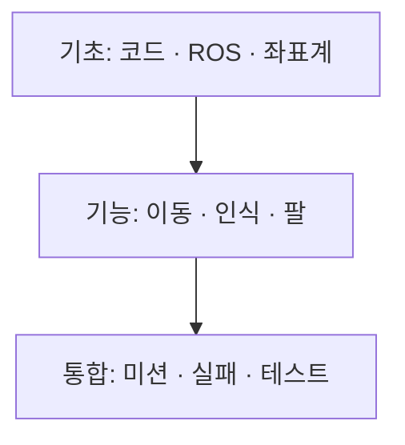

# Cleany로 배우는 로봇 소프트웨어

로봇이 처음이라도, 우리 프로젝트의 코드를 직접 읽고 작은 실행 결과를 설명할 수 있도록 만든 입문서입니다. 각 장은 기초 개념부터 시작해 실제 구현, 코드 추적, 작은 실습으로 이어집니다. 후반의 세부 절에서는 우리 시스템의 데이터와 호출 흐름을 직접 따라갑니다.



*학습용 도식 · 이 가이드에서 직접 작성*

## 처음 시작한다면

변수, 함수, `if`를 본 적이 있으면 시작할 수 있습니다. Python의 클래스나 ROS는 본문에서 필요한 만큼 설명합니다. 첫 실습은 Python 3.10 이상만 있으면 되고, ROS 설치나 실제 로봇이 필요하지 않습니다.

1. [시스템 아키텍처](chapters/01-code-map.md)를 읽습니다.
2. [Mission Core와 Mock](chapters/02-first-mission.md)을 실행합니다.
3. 결과를 먼저 예상하고, 실제 출력과 비교합니다.

처음에는 1~4장을 순서대로 읽고, 이후에는 다른 팀원이 맡은 영역부터 읽어도 좋습니다. 각 장의 앞부분에서 개념을 익힌 뒤 세부 절에서 구현을 확인하세요.

## 목차

| 장 | 구현에서 확인할 내용 |
| --- | --- |
| [01. 시스템 아키텍처](chapters/01-code-map.md) | 패키지 구성, 실행 진입점, Core와 Port |
| [02. Mission Core와 Mock](chapters/02-first-mission.md) | 모의 실행, 요청과 상태, 데이터 전달 |
| [03. ROS 2 통신과 인터페이스](chapters/03-ros-basics.md) | Topic·Service·Action, 메시지, 서버 콜백 |
| [04. URDF와 TF](chapters/04-frames.md) | Link·Joint, 카메라 모델, TF 발행과 시간 |
| [05. 메카넘 베이스 제어](chapters/05-mobile-base.md) | Twist, 역기구학, Encoder·PI, MCU 통신 |
| [06. SLAM과 Navigation](chapters/06-mapping.md) | 센서 입력, slam_toolbox, Cartographer, 통합 경계 |
| [07. RGB-D와 점군](chapters/07-rgbd.md) | 분할, 유효 깊이, 투영, Frame·snapshot |
| [08. Grasp와 MoveIt](chapters/08-grasp.md) | 후보 생성·필터, TCP, 양팔 선택, MoveIt |
| [09. Hand-eye Calibration](chapters/09-calibration.md) | 피드백 동기화, PnP, solver, 독립 평가 |
| [10. Mission FSM과 실패 처리](chapters/10-mission.md) | 상태 전이, 재시도, BLOCKED·FATAL, 보고서 |
| [11. 테스트와 디버깅](chapters/11-debugging.md) | 점군·후보 추적, 테스트, 로그, 팀 리뷰 |

## 책처럼 열기

저장소 루트에서 다음 명령을 실행합니다. 로봇 프로그램을 실행하는 명령은 아닙니다.

```bash
python3 -m http.server 8765 --bind 127.0.0.1
```

브라우저에서 [가이드 열기](http://127.0.0.1:8765/docs/guide/)로 접속합니다. 종료는 터미널에서 `Ctrl-C`입니다. 포트가 사용 중이면 다른 번호를 선택하고 주소도 함께 바꿉니다.

뷰어는 `index.html` 하나에 화면 구성과 탐색 기능을 담고, `guide.json`의 목차에 따라 Markdown을 읽습니다. 외부 CDN과 빌드 과정은 없습니다. 왼쪽에 부 → 장 → 절의 3단 목차를 표시합니다. 장 펼치기·접기, 절 검색, 현재 절 표시, 이전·다음 페이지, 직접 링크, 코드 복사, 작은 화면의 접이식 목차를 제공합니다. **HTML 더블 클릭은 `fetch` 제한 때문에 지원하지 않습니다.** 반드시 위 HTTP 주소를 사용하세요.

## 무엇을 기준으로 썼나요?

구현 확인 기준은 **`47bc1f7`**, 작성일은 **2026-10-01**입니다. 다른 브랜치의 진행 사항이나 main의 미커밋 실험은 이 초판의 구현 범위에 포함하지 않습니다. 코드가 바뀌면 해당 장의 설명과 실습도 함께 갱신해야 합니다.

| 자료 | 확인할 내용 |
| --- | --- |
| [기획 KB](../cleany-docs/README.md) | 목표, 설계, 결정 이유 |
| [개발환경 설치](../DEVELOPMENT_SETUP.md) | Ubuntu와 ROS 설치 |
| [ROS workspace 안내](../../ros2_ws/README.md), 패키지 README | 현재 설정, 실행 조건, 검증 명령 |
| 이 가이드 | 개념의 의미와 구현을 따라 읽는 순서 |

본문의 **구현**은 소스가 있다는 뜻입니다. **모의 실습**은 정해진 응답으로 순수 코드를 실행한다는 뜻입니다. **시뮬레이션 데모**는 가상 로봇 실행 경로가 있다는 뜻입니다. 어느 것도 그 자체로 실물 수거 성공을 뜻하지 않습니다. 실제 로봇 실행은 이 입문서의 실습 범위에 포함하지 않습니다.

## 문서를 이어서 쓰는 팀원에게

각 장의 세부 절은 `기초 개념 → 시스템 구성 → 실제 코드와 데이터 흐름 → 작은 실습` 순서로 깊어지게 씁니다. 전체 파일을 복사하는 대신 핵심 함수와 원본 파일을 연결합니다. 실행 실습에는 준비 조건과 관찰할 결과를 적고, 미구현 부분에는 현재 경계를 표시합니다.

장이나 번호가 붙은 H2 절을 추가·수정하면 `guide.json`의 제목과 `sections`도 함께 갱신합니다. 절의 `id`는 뷰어가 생성하는 제목 앵커와 맞춰야 합니다. 새 장은 이 목차에도 추가합니다. 담당자가 구현 사실을 확인하고, 다른 영역 팀원이 실습과 설명을 읽어보면 좋습니다. SVG·이미지 자산은 `assets/`, 브라우저 라이브러리와 라이선스는 [vendor](vendor/README.md)에 있습니다.

그림 형식은 설명할 대상에 맞춰 고릅니다. 간단한 흐름·역할·상태 관계는 Markdown의 `mermaid` 코드 블록으로 작성합니다. 좌표축·기하·장착 위치처럼 공간 배치가 중요한 도식은 SVG를 사용합니다. 실제 화면과 측정 결과는 캡처나 그래프로 제시하고, Imagen 같은 이미지 생성 도구는 직관적인 개념 삽화에 사용합니다. 생성 삽화는 한 가지 내용을 간결하게 표현하고, 복잡한 구조와 긴 텍스트를 한 그림에 섞지 않습니다. 각 그림에는 출처와 개념도·실제 결과 여부를 표시합니다.

구성 방식은 [점프 투 파이썬](https://wikidocs.net/book/1)의 기초부터 심화로 올라가는 순서, [점프 투 자바](https://wikidocs.net/book/31)의 사용 맥락 중심 설명, [점프 투 장고](https://wikidocs.net/72280)의 장 목표와 부분 코드·전체 소스 연결을 참고했습니다. 본문과 그림을 복제하지 않았습니다. 기술 개념의 외부 근거는 각 장에 연결했습니다.
