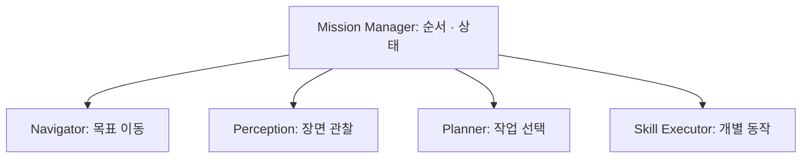

# 01. 시스템 아키텍처

> 목표: 패키지 구조, 모듈 경계와 실행 진입점을 연결하고 현재 구현의 위치를 찾습니다.

## 01.1 시스템 구성과 책임

책상 위 캔을 처리하려면 이동하고, 보고, 할 일을 고르고, 팔을 움직여야 합니다. Cleany는 이 역할을 나눕니다. 먼저 각 역할이 **어떤 질문에 답하는지**부터 보면 됩니다.



*책임을 나타낸 개념도 · 선은 현재 ROS 연결 상태를 뜻하지 않습니다.*

| 역할 | 답하는 질문 |
| --- | --- |
| Mission Manager | 지금 어떤 단계이며 다음에 무엇을 호출할까? |
| Navigator | 목표까지 이동했는가? |
| Perception | 주변에 무엇이 관측됐는가? |
| Planner | 관측한 물체로 어떤 작업을 할까? |
| Skill Executor | 지정한 개별 동작을 수행할 수 있는가? |
| Reporter | 무엇이 완료·실패·차단됐는가? |

“캔을 치우자”는 작업 수준의 판단이고, “어느 팔의 관절을 어떤 경로로 움직일까?”는 동작 수준의 문제입니다. 역할의 입력과 출력이 다르므로 읽어야 할 코드도 다릅니다.

## 01.2 저장소와 패키지 구조

**패키지**는 관련 코드와 설정·의존성을 묶은 단위입니다. 이 저장소의 로봇 코드는 `ros2_ws/src/`에 있고, ESP32 펌웨어는 `motor_controller/`에 있습니다.

```text
ros2_ws/src/
├── cleany_interfaces/       # 공통 ROS 데이터 계약
├── cleany_mission_manager/  # 미션 core와 응답 대역
├── cleany_navigation/       # SLAM 설정과 launch
├── cleany_description/      # 공통 로봇 모델
├── cleany_gazebo_sim/       # 주행·센서 시뮬레이션
├── cleany_mujoco_sim/       # 조작·센서 시뮬레이션
├── cleany_grasping/          # 파지 후보 생성·필터
├── cleany_skill_executor/    # 후보 평가와 조작 데모
└── cleany_handeye_calibration/ # 손목 카메라 보정
motor_controller/             # 모터·encoder·MCU 통신
```

이 트리는 학습에 필요한 위치만 발췌했습니다. 모든 패키지가 하나의 동작 경로에 동시에 사용되는 것은 아닙니다. Gazebo 주행과 MuJoCo 조작은 실행 경로부터 다릅니다.

파일 종류도 단서입니다. `launch/`는 프로그램 기동 구성, `config/`는 설정, `test/`·`tests/`는 기대 동작, `core/`는 외부 도구와 분리한 계산·판단을 담습니다. 생성물인 `build/`, `install/`, `log/`에서 소스를 수정하지 않습니다.

## 01.3 ROS 패키지와 실행 진입점

ROS는 `package.xml`로 패키지 이름·의존성·빌드 방식을 확인합니다. [Mission Manager package.xml](../../../ros2_ws/src/cleany_mission_manager/package.xml)의 실제 선언입니다.

```xml
<export>
  <build_type>ament_python</build_type>
</export>
```

Python 패키지의 [setup.py](../../../ros2_ws/src/cleany_mission_manager/setup.py)는 어떤 모듈과 데이터를 설치할지 정합니다. ROS 패키지로 설치할 수 있다는 사실과 실행 가능한 ROS 노드가 있다는 사실은 다릅니다. 현재 Mission Manager의 `setup.py`에는 `console_scripts` 진입점이 없습니다.

반면 [grasping setup.py](../../../ros2_ws/src/cleany_grasping/setup.py)는 `grasp_server`라는 실행 이름을 `grasp_node:main`에 연결합니다. 따라서 코드를 읽을 때는 **패키지 이름 → 실행 이름 → main 함수 → node의 callback → core** 순으로 좁히면 됩니다. 3장에서 이 경로를 실제 서비스와 연결합니다.

공통 개발 명령은 [Makefile](../../../Makefile)과 [workspace README](../../../ros2_ws/README.md)가 관리합니다. 개별 파일의 존재만 보고 실행 명령을 추측하지 않습니다.

## 01.4 Core와 Port 경계

Mission core는 ROS 객체를 직접 받아 처리하지 않습니다. 대신 역할마다 필요한 함수의 약속인 **Port**를 사용합니다. [ports.py](../../../ros2_ws/src/cleany_mission_manager/cleany_mission_manager/core/ports.py)의 실제 선언입니다.

```python
class Planner(Protocol):
    def plan(self, world_state: Any) -> ModuleResult[Any]:
        ...
```

`Protocol`은 “이 함수 형태를 제공하는 객체를 받을 수 있다”는 타입 약속입니다. `...`는 여기서 구현을 제공하지 않는다는 뜻입니다. 실제 계산은 그 약속을 만족하는 다른 객체가 수행합니다.

[manager.py](../../../ros2_ws/src/cleany_mission_manager/cleany_mission_manager/core/manager.py)는 `self.planner.plan(self.context.world_state)`를 호출합니다. Planner의 내부가 규칙 기반인지, 외부 API인지, mock인지는 이 호출 자체에 드러나지 않습니다. 외부 기능을 Port에 맞춰 연결하는 코드를 **adapter**라고 부릅니다.

이 분리는 수정 범위를 좁힙니다. 파지 필터를 고칠 때는 후보 처리 코드를 보고, 미션이 실패 후 어디로 넘어갈지를 고칠 때는 Manager를 봅니다. 입력·출력 약속이 바뀌면 그 경계 양쪽을 함께 확인해야 합니다.

## 01.5 현재 구현과 통합 경계

| 부분 | 이 기준 커밋에서 읽을 수 있는 구현 |
| --- | --- |
| Mission | 순수 core, mock·scripted Port, 상태·재시도·보고 테스트 |
| Navigation | slam_toolbox·Cartographer 설정과 launch; 통합 Nav2 주행 launch는 없음 |
| Perception | 패키지 자체는 scaffold; 빨간 캔 RGB-D 처리는 별도 MuJoCo 데모에 구현 |
| Grasp·Skill | 점군 후보 생성·선택·MoveIt 평가와 별도 시뮬레이션 실행 |
| Calibration | 왼쪽 손목 카메라 자료 수집·PnP·solver·평가 경로 |
| MCU | 모터 제어, encoder, binary serial protocol |

`cleany_planner`, `cleany_perception`, `cleany_robot_interface`의 scaffold는 책임을 기록한 뼈대 상태입니다. 전체 시스템의 목표는 [KB 기술 개요](../../cleany-docs/20_TECHNICAL/00%20-%20Technical%20Overview.md)에서 확인하고, 실제 실행 경로는 위의 소스와 각 README를 봅니다.

`MissionRequest.requested_by="dashboard"`라는 예시 문자열도 Dashboard와의 실제 네트워크 연결을 뜻하지 않습니다. 연결을 확인하려면 요청을 받는 adapter와 공개 ROS/API 계약을 찾아야 합니다.

## 01.6 시스템 코드 추적 실습

“캔 후보가 만들어졌지만 팔이 움직이지 않는다”는 질문의 시작점은 Mission 상태만은 아닙니다. 이 커밋에는 별도 조작 데모가 있으므로 다음 순서로 확인합니다.

1. [Skill Executor README](../../../ros2_ws/src/cleany_skill_executor/README.md)에서 사용한 실행 경로를 찾습니다.
2. 후보 **선택** action과 **실행** demo coordinator의 파일을 구분합니다.
3. 후보 생성·팔 평가·실행 각각의 출력이 무엇인지 적습니다.

**확인 질문:** 어떤 파일을 열어야 할지 모를 때 패키지 이름만 찾으면 충분할까요?

<details><summary>생각을 비교해 보기</summary>

패키지 이름에 이어 실행 진입점과 호출하는 경로까지 확인해야 합니다. 이름이 Perception인 폴더가 scaffold일 수 있고, 실제 인식 코드는 데모 안에 있을 수 있습니다. 다음 장에서는 외부 장치를 배제하고 Mission core의 한 경로를 끝까지 따라갑니다.

</details>
