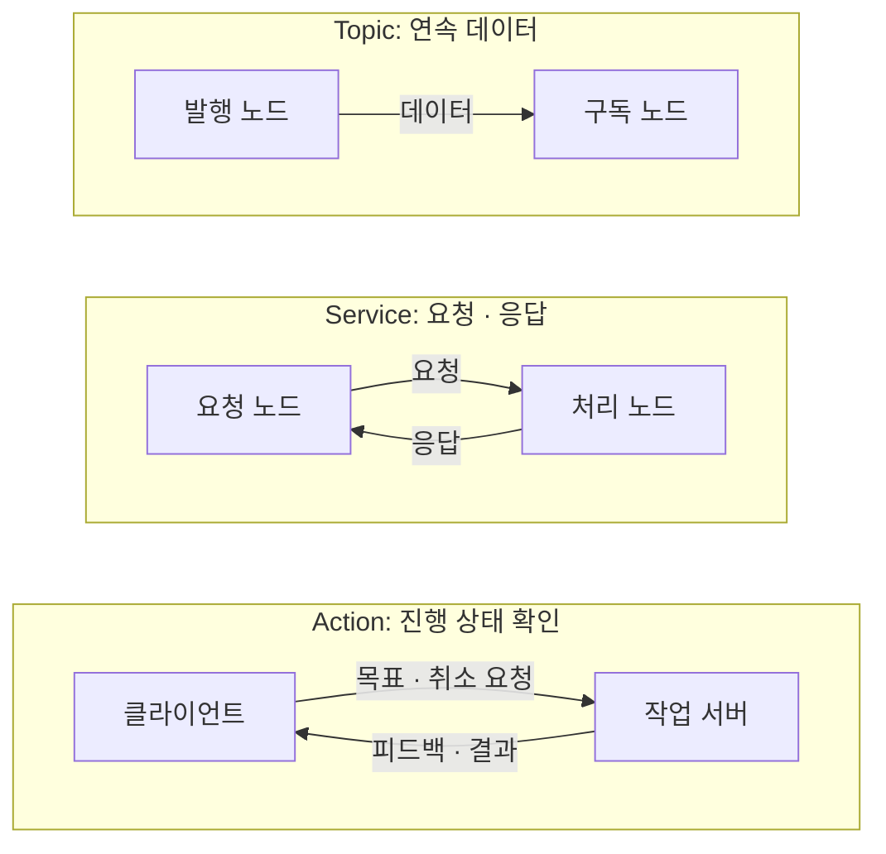

# 03. ROS 2 통신과 인터페이스

> 목표: 통신 방식을 구분하고, Cleany의 메시지 정의에서 실제 서비스 콜백까지 추적합니다.

## 03.1 노드와 ROS 그래프

앞 장의 mock은 한 Python 프로그램 안에서 함수를 호출했습니다. 실제 센서 프로그램과 팔 제어 프로그램은 별도로 실행될 수 있습니다. **ROS 2**는 이 프로그램들이 데이터를 주고받도록 연결합니다. 통신에 참여하는 구성 단위를 **노드**(node)라고 부릅니다.

노드 이름, 실행 파일 이름, 토픽 이름은 서로 다릅니다. 예를 들어 `cleany_grasping` 패키지의 실행 파일 `grasp_server`는 Python의 `GraspNode`를 만들고, 이 노드는 기본 `grasp/plan` 서비스를 제공합니다. 파일명을 검색하는 것과 통신 이름을 검색하는 것은 다른 출발점입니다.



*통신 방식의 개념도 · 직접 작성*

노드와 통신 연결을 합쳐 **ROS 그래프**라고 부릅니다. 처음 코드를 읽을 때는 모든 클래스보다 “어떤 노드가 어떤 이름으로 무엇을 보내는가?”를 먼저 찾으면 연결이 보입니다.

## 03.2 Topic·Service·Action

| 방식 | 동작 | Cleany의 예 |
| --- | --- | --- |
| 토픽(topic) | 데이터를 계속 발행·구독 | `/scan`, `/joint_states`, `/cmd_vel` |
| 서비스(service) | 요청 하나에 응답 하나 | `PlanGrasp.srv`로 후보 생성 요청 |
| 액션(action) | 목표·진행 피드백·결과·취소 | `SelectReachableGrasp.action`으로 후보 평가 |

**콜백**(callback)은 입력이 도착했을 때 실행할 함수입니다. **파라미터**(parameter)는 frame 이름이나 timeout처럼 실행 시 설정할 값이고, **launch**는 노드와 파라미터를 함께 시작하는 구성입니다.

토픽을 발행했다는 사실만으로 동작 성공을 알 수는 없습니다. `/cmd_vel`은 속도 명령이며 목적지 도착 결과가 아닙니다. 서비스가 긴 계산을 금지하는 것도 아닙니다. 작업 중 진행 상황과 취소가 필요한지에 따라 액션을 선택합니다.

`.msg`는 데이터 필드, `.srv`는 요청·응답, `.action`은 목표·결과·피드백을 정의합니다. `.srv`에는 `---` 한 개, `.action`에는 두 개가 있으므로 구분선부터 읽어보세요.

## 03.3 객체 메시지와 Header

[DetectedObject3D.msg](../../../ros2_ws/src/cleany_interfaces/msg/DetectedObject3D.msg)는 번호·이름·신뢰도·경계 상자를 담습니다. 아래는 주석을 생략하고 필드만 모은 발췌입니다.

```text
uint32 object_id
string label
float32 confidence
geometry_msgs/Pose obb_pose
geometry_msgs/Vector3 obb_size
```

**OBB**(Oriented Bounding Box)는 방향을 가진 경계 상자입니다. `obb_pose`는 중심 위치·방향이고 `obb_size`는 각 축의 전체 길이(m)입니다. `object_id`는 snapshot 안의 선택 번호이며 전역 영구 ID가 아닙니다.

좌표와 촬영 시각은 어디에 있을까요? [DetectedObject3DArray.msg](../../../ros2_ws/src/cleany_interfaces/msg/DetectedObject3DArray.msg)의 필드를 확인합니다. 역시 주석은 생략했습니다.

```text
std_msgs/Header header
string snapshot_id
DetectedObject3D[] objects
```

`header.frame_id`는 좌표 기준이고 `header.stamp`는 공통 촬영 시각입니다. 모든 객체가 이 header를 공유합니다. 숫자가 같아도 frame이 다르면 같은 위치가 아닐 수 있습니다. `snapshot_id`는 인식 결과와 이후 요청을 연결하는 식별자입니다.

[InspectScene.action](../../../ros2_ws/src/cleany_interfaces/action/InspectScene.action)은 RGB-D 관측을 요청하고 이 배열을 받는 계약입니다. 현재 `cleany_perception`은 scaffold이므로 인터페이스 파일이 있다고 범용 인식 서버까지 구현되었다고 읽으면 안 됩니다. 실행 가능한 빨간 캔 경로는 07장에서 별도 데모로 살펴봅니다.

## 03.4 PlanGrasp 요청과 응답

[PlanGrasp.srv](../../../ros2_ws/src/cleany_interfaces/srv/PlanGrasp.srv)의 요청 부분은 다음과 같습니다. 구분선 앞의 실제 연속 발췌입니다.

```text
string snapshot_id
uint32 object_id
sensor_msgs/PointCloud2 target_cloud
sensor_msgs/PointCloud2 context_cloud
# OBB pose uses the same frame and capture time as both point clouds.
DetectedObject3D target_object
---
```

**target** 점군은 선택 물체이고 **context** 점군은 주변까지 포함합니다. 요청자가 두 점군과 대상 객체를 직접 전달합니다. 서버가 `snapshot_id`만 받아 과거 점군을 cache에서 찾아주는 구조가 아닙니다.

응답에는 `success`, `error_code`, `message`, `GraspCandidate[] candidates`가 있습니다. 성공했다면 후보를 얻었다는 뜻이며 팔 이동 완료가 아닙니다. 후보를 양팔 IK·계획으로 평가하는 action은 별도의 다음 단계입니다.

실제 `GraspNode._validate()`는 ID 일치, 두 점군의 동일 frame·stamp, OBB의 유효 크기와 자세를 검사합니다. 문서로 정한 계약이 코드에서 어떻게 강제되는지 볼 수 있는 지점입니다.

## 03.5 grasp_server 실행과 콜백

[setup.py](../../../ros2_ws/src/cleany_grasping/setup.py)의 실제 entry point 한 줄입니다.

```python
entry_points={'console_scripts': ['grasp_server = cleany_grasping.grasp_node:main']},
```

`ros2 run cleany_grasping grasp_server`의 실행 이름이 `grasp_node.py`의 `main()`으로 연결됩니다. `main()`은 `rclpy.init()`, `GraspNode()` 생성, `rclpy.spin(node)` 순으로 시작합니다. spin은 ROS 이벤트를 기다리며 콜백을 실행합니다.

[grasp_node.py](../../../ros2_ws/src/cleany_grasping/cleany_grasping/grasp_node.py)의 `GraspNode.__init__()`에서 서비스를 등록하는 실제 발췌입니다.

```python
self._service = self.create_service(
    PlanGrasp, str(self.get_parameter('service_name').value), self._plan
)
```

타입은 `PlanGrasp`, 이름은 파라미터 `service_name`, 콜백은 `_plan`입니다. 기본 상대 이름 `grasp/plan`은 기본 namespace에서 `/grasp/plan`으로 보입니다. namespace나 remap을 적용하면 실제 이름이 달라질 수 있습니다.

`_plan()`은 다음 순서로 읽습니다. 아래는 원문 발췌가 아닌 호출 흐름 요약입니다.

```text
_validate(request)
→ point_cloud_from_message(target/context)
→ 파라미터로 GraspConfig 생성
→ predictor.predict() → rank_grasps()
→ planning_frame 좌표 변환
→ GraspCandidate 메시지 구성 → response 반환
```

ROS 메시지 변환과 응답은 node가 맡고, 후보 계산은 core가 맡습니다. backend가 없으면 `ERROR_MODEL_UNAVAILABLE`, 입력·TF 문제가 있으면 `ERROR_INVALID_INPUT`, 후보가 없으면 `ERROR_NO_GRASP_CANDIDATE`로 구분합니다. 상세 후보 계산은 08장에서 이어갑니다.

## 03.6 인터페이스 추적 실습

[개발환경 설치](../../DEVELOPMENT_SETUP.md)와 `cleany_interfaces` 빌드가 끝난 저장소 루트 터미널에서 실행합니다. 실행 중인 로봇이나 시뮬레이터는 필요하지 않습니다.

```bash
source /opt/ros/humble/setup.bash
source ros2_ws/install/setup.bash
ros2 interface show cleany_interfaces/msg/DetectedObject3DArray
ros2 interface show cleany_interfaces/srv/PlanGrasp
ros2 interface show cleany_interfaces/action/SelectReachableGrasp
```

설치 전이라면 [원본 인터페이스 폴더](../../../ros2_ws/src/cleany_interfaces/README.md)를 읽어도 됩니다. 다음 세 가지를 찾아보세요.

1. `PlanGrasp`에서 요청의 ID와 응답의 후보 배열을 찾습니다.
2. `SelectReachableGrasp`에서 목표와 진행 피드백의 `arm` 필드를 구분합니다.
3. `_plan()`에서 `response.success = True`를 찾아 무엇을 마쳤을 때 실행되는지 설명합니다.

**확인 질문:** `PlanGrasp` 성공을 보고 로봇이 물체를 잡았다고 기록해도 될까요?

<details><summary>생각을 비교해 보기</summary>

이 서비스는 후보를 생성합니다. 도달 평가, 실제 이동, 그리퍼 동작과 물체 파지 확인은 이후 별도 단계입니다. 메시지의 success는 해당 인터페이스가 약속한 작업 범위 안에서 읽어야 합니다.

</details>
