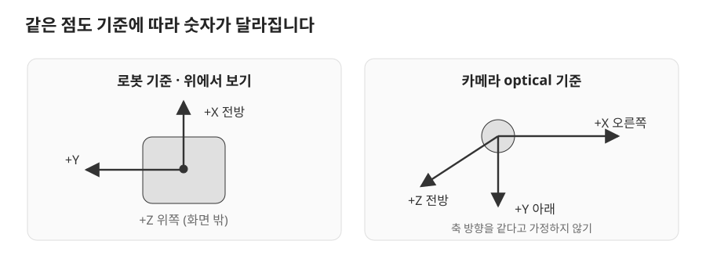

# 04. URDF와 TF

> 목표: 좌표계 개념에서 출발해 Cleany 모델의 관절과 센서 TF를 읽고, 각 변환을 누가 발행하는지 추적합니다.

## 04.1 좌표계와 ROS 축 규약

로봇이 왼쪽을 바라보면 로봇의 앞과 방의 앞은 달라집니다. 좌표에는 **어느 기준점에서, 어느 축을 따라 잰 값인지**가 필요합니다. 그 기준이 **좌표계**(frame)입니다.



*REP-103의 축 규약을 바탕으로 직접 그린 개념도*

| frame | 의미 | 축 또는 특성 |
| --- | --- | --- |
| `base_link` | 로봇 몸의 기준 | X 전방, Y 좌측, Z 위 |
| `odom` | 이동량을 누적하는 기준 | 연속적이지만 오차가 쌓일 수 있음 |
| `map` | 지도에 맞춘 전역 기준 | 위치 보정 시 좌표가 뛸 수 있음 |
| `*_optical_frame` | 카메라 영상·깊이의 기준 | X 우측, Y 아래, Z 전방 |

같은 `(0, 0, 1)`도 `base_link`에서는 위쪽 1m, optical frame에서는 앞쪽 1m입니다. 좌표값을 넘길 때 frame을 빠뜨리면 숫자가 정상이어도 엉뚱한 목표가 됩니다.

ROS의 길이는 m, 각도는 rad입니다. 예를 들어 `linear.y=0.2`는 로봇 기준 좌측 **속도 0.2m/s**이며 이동 거리 0.2m가 아닙니다. 회전 부호는 오른손 법칙을 따르고, 위에서 본 양의 yaw는 반시계 방향입니다.

## 04.2 URDF의 Link와 Joint

**URDF**는 로봇 부품인 `link`와 부품 사이 관계인 `joint`를 설명합니다. `fixed` 관절은 고정된 장착 관계이고, `revolute` 관절은 한 축을 중심으로 회전합니다. **Xacro**는 반복되는 모델을 macro로 묶고 옵션에 따라 펼쳐 URDF를 만드는 도구입니다.

Cleany의 공통 모델 위치는 [cleany_description README](../../../ros2_ws/src/cleany_description/README.md)에 정리되어 있습니다.

| 파일 | 담당하는 내용 |
| --- | --- |
| [cleany_geometry.xacro](../../../ros2_ws/src/cleany_description/urdf/cleany_geometry.xacro) | 공통 물리 모델 |
| [cleany.urdf.xacro](../../../ros2_ws/src/cleany_description/urdf/cleany.urdf.xacro) | TF·MoveIt에서 쓰는 plugin-free 설명 |
| [cleany_control.urdf.xacro](../../../ros2_ws/src/cleany_description/urdf/cleany_control.urdf.xacro) | MuJoCo 제어 backend를 추가하는 진입점 |
| [head_camera.xacro](../../../ros2_ws/src/cleany_description/urdf/head_camera.xacro) | 머리 pan/tilt와 RGB-D frame |

`robot_state_publisher`는 URDF와 관절 상태를 이용해 link 사이 TF를 제공합니다. 모델 파일이 존재하는 것과 현재 관절값이 들어오는 것은 별개의 조건입니다. 움직이는 관절의 각도를 모르면서 센서 위치를 정확히 계산할 수는 없습니다.

## 04.3 Head Camera 모델 읽기

다음은 [head_camera.xacro](../../../ros2_ws/src/cleany_description/urdf/head_camera.xacro)의 실제 tilt 관절입니다.

```xml
<link name="head_tilt_link"/>
<joint name="head_tilt_joint" type="revolute">
  <parent link="head_pan_link"/>
  <child link="head_tilt_link"/>
  <origin xyz="0.001 0.002 0.09815" rpy="0 0 3.14159265359"/>
  <axis xyz="0 1 0"/>
  <limit lower="-0.76" upper="1.45" effort="2.6477955" velocity="4.245"/>
</joint>
```

`origin`은 부모 link에서 관절 기준으로 가는 고정 관계이고, `axis`는 그 관절 기준의 회전축입니다. `limit`의 각도와 속도는 rad와 rad/s입니다. 위 수치는 이 모델의 설정이며 실물 보정 결과를 뜻하지 않습니다.

관계를 이어 읽으면 다음 경로가 나옵니다.

```text
base_link → top_base_link → head_pan_link → head_tilt_link
          → head_camera_link → head_camera_rgb_frame
                             → head_camera_rgb_optical_frame
```

마지막 optical joint는 `rpy="-1.57079632679 0 -1.57079632679"`로 카메라 축 규약을 적용합니다. RGB와 depth optical 원점은 명목상 같은 곳입니다. 실물 RealSense 보정값을 측정해 넣었다는 의미는 아닙니다.

또한 실행 진입점마다 모델 범위가 다릅니다. 현재 arm-control 설명은 head tree를 제외하고 팔 10관절과 gripper 2관절의 상태 계약을 유지합니다. 모델 수정 전에는 **어느 launch가 어느 xacro를 펼치는지**부터 확인하세요.

## 04.4 TF 발행 주체와 시간

TF는 좌표계 사이 위치·방향을 **시간과 함께** 다룹니다. 보통 이동 로봇에서는 `map → odom → base_link → 센서`를 사용합니다. Cleany의 Gazebo SLAM 경로에서는 역할이 다음처럼 나뉩니다.

| 변환 | 제공하는 코드 또는 노드 |
| --- | --- |
| `map → odom` | 실행 중인 SLAM backend |
| `odom → base_link` | [GazeboOdomTfPublisher](../../../ros2_ws/src/cleany_gazebo_sim/cleany_gazebo_sim/odom_tf_publisher.py) |
| `base_link → lidar_link`, `imu_link` | [GazeboSensorTfPublisher](../../../ros2_ws/src/cleany_gazebo_sim/cleany_gazebo_sim/sensor_tf_publisher.py) |
| 모델의 link·joint 관계 | 해당 모델을 실행한 `robot_state_publisher` |

Gazebo sensor publisher는 [base.yaml](../../../ros2_ws/src/cleany_gazebo_sim/config/base.yaml)의 위치·회전을 읽어 `StaticTransformBroadcaster`로 발행합니다. 이 설정의 LiDAR 위치는 `[0.16, 0.0, -0.12]`입니다. 이 값은 Gazebo 모델의 장착 관계이며 head camera xacro와 다른 경로에서 관리됩니다.

odom publisher의 실제 발행 부분은 다음과 같습니다.

```python
transform = TransformStamped()
transform.header = output.header
transform.child_frame_id = self._base_frame_id
transform.transform.translation.x = output.pose.pose.position.x
transform.transform.translation.y = output.pose.pose.position.y
transform.transform.translation.z = output.pose.pose.position.z
transform.transform.rotation = output.pose.pose.orientation
self._tf_broadcaster.sendTransform(transform)
```

`output.header`를 보존하므로 변환은 원본 odometry의 시각을 사용합니다. 입력 `/gazebo_odom`은 bridge가 연결한 ground-truth이고, 이 노드는 pose를 encoder로 다시 계산하지 않습니다.

촬영 뒤 팔이나 머리가 움직였다면 최신 TF로 예전 이미지의 점을 옮기는 것은 잘못된 조합일 수 있습니다. 영상 시각의 TF가 필요하고, 시뮬레이션에서는 관련 노드가 `/clock`을 사용해야 합니다. 같은 변환을 두 노드가 서로 다른 값으로 발행하는 것도 피해야 합니다.

## 04.5 TF 오류 추적 실습

먼저 ROS 없이 파일 세 개를 비교하세요. [head_camera.xacro](../../../ros2_ws/src/cleany_description/urdf/head_camera.xacro)의 부모·자식 이름, [base.yaml](../../../ros2_ws/src/cleany_gazebo_sim/config/base.yaml)의 센서 이름, [slam_toolbox.yaml](../../../ros2_ws/src/cleany_navigation/config/slam/slam_toolbox.yaml)의 `map_frame`, `odom_frame`, `base_frame`입니다. 이름을 적고 각 관계의 발행 주체를 표시해 보세요.

06장의 독립된 Gazebo·SLAM 실습 환경을 실행한 경우 다음 읽기 전용 명령으로 확인할 수 있습니다.

```bash
ros2 run tf2_ros tf2_echo odom base_link
ros2 run tf2_ros tf2_echo base_link lidar_link
```

첫 관계가 없으면 odometry 입력과 publisher를, 두 번째가 없으면 sensor publisher와 frame 설정을 살펴봅니다. 토픽이 있어도 frame 연결이 없을 수 있습니다. `extrapolation` 오류가 나오면 이름뿐 아니라 timestamp와 `use_sim_time`도 확인합니다. 카메라 frame은 그 모델·상태 publisher가 실행된 환경에서 따로 확인해야 합니다.

**확인 질문:** 카메라에서 얻은 점을 MoveIt의 계획 frame으로 전달할 때 좌표값 외에 무엇을 알아야 할까요?

<details><summary>생각을 비교해 보기</summary>

출발 frame, 도착 frame, 측정 시각과 그 시각의 변환 경로가 필요합니다. 모델의 명목 장착 관계와 실물 보정 정확도도 구분해야 합니다.

</details>

더 읽기: [REP-103 축·단위 규약](https://github.com/ros-infrastructure/rep/blob/master/rep-0103.rst), [REP-105 이동 로봇 frame](https://github.com/ros-infrastructure/rep/blob/master/rep-0105.rst).
