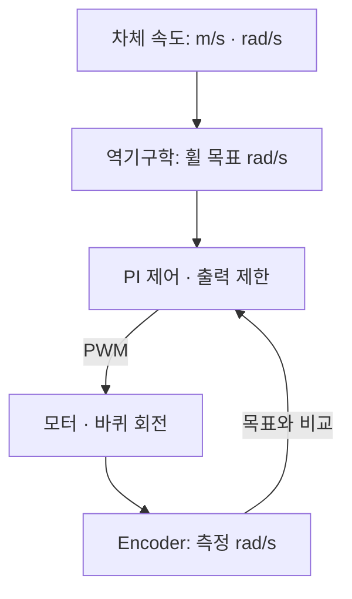

# 05. 메카넘 베이스 제어

> 목표: 차체 명령에서 바퀴 목표와 encoder feedback까지 추적하고, 시뮬레이터와 MCU 구현의 경계를 구분합니다. 실습은 계산만 하며 모터를 구동하지 않습니다.

## 05.1 Twist와 차체 속도

메카넘 바퀴에는 기울어진 롤러가 있습니다. 네 바퀴 회전의 조합으로 전후 이동, 횡이동, 회전을 만듭니다. 그래서 “왼쪽으로 이동하라”는 차체 명령을 바퀴별 속도로 바꾸는 **역기구학**이 필요합니다.



*속도 제어 개념도 · 현재 ROS와 MCU가 연결되었다는 배선도가 아닙니다.*

| 단계 | 값 | 단위 |
| --- | --- | --- |
| 차체 명령 | `linear.x`, `linear.y`, `angular.z` | m/s, m/s, rad/s |
| 바퀴 목표 | FL, FR, RL, RR 회전 속도 | rad/s |
| 측정 | encoder count 또는 환산 속도 | count, rad/s |
| 모터 출력 | PWM 비율 | % |

[Mobile base contract](../../../ros2_ws/src/cleany_interfaces/docs/mobile_base.md)는 `/cmd_vel`의 `Twist`를 **`base_link` 기준**으로 정의합니다. `Twist`에는 frame 필드가 없으므로 이 약속을 발행자와 수신자가 함께 지켜야 합니다. 속도 명령은 성공 응답이 없는 연속 스트림입니다. 이동 결과는 `/odom` 등의 상태로 확인합니다.

## 05.2 명령 제한과 Gazebo 경로

공통 계약은 세 지원 축의 최대 속도, 잘못된 값과 timeout 처리까지 정의합니다. 미지원 축은 무시하고 경고하며, 여섯 축 중 하나라도 `NaN`·무한대이면 메시지를 폐기하고 정지 목표를 적용합니다. timeout은 `Twist`에 시각이 없으므로 수신한 monotonic time을 사용합니다.

Gazebo에서는 `cmd_vel → command_guard → Gazebo용 명령 → bridge → 시뮬레이터`로 전달합니다. 관련 진입점은 [gazebo_fortress.launch.py](../../../ros2_ws/src/cleany_gazebo_sim/launch/gazebo_fortress.launch.py), guard는 [command_guard.py](../../../ros2_ws/src/cleany_gazebo_sim/cleany_gazebo_sim/command_guard.py), bridge 매핑은 [core_bridge.yaml](../../../ros2_ws/src/cleany_gazebo_sim/config/bridge/core_bridge.yaml)입니다.

[base.yaml](../../../ros2_ws/src/cleany_gazebo_sim/config/base.yaml)의 실제 guard 설정은 다음과 같습니다.

```yaml
gazebo_command_guard:
  ros__parameters:
    max_linear_x: 0.3
    max_linear_y: 0.3
    max_angular_z: 0.8
    cmd_vel_timeout_sec: 0.5
    timeout_check_rate_hz: 20.0
```

이 값은 이 Gazebo profile의 설정입니다. 공통 계약이 실물 최대 속도를 확정한 것은 아닙니다. timeout은 새 명령이 끊겼을 때 제어 목표를 0으로 만드는 장치이며 물리적 감속 거리와 정지 시간은 별도입니다.

## 05.3 메카넘 역기구학과 속도 제한

[wheel_speeds_from_chassis()](../../../ros2_ws/src/cleany_mujoco_sim/cleany_mujoco_sim/mecanum_kinematics.py)는 ROS에 의존하지 않는 순수 계산 함수입니다. 입력은 `ChassisCommand`, 형상은 `MecanumGeometry`, 출력은 네 이름을 가진 `WheelSpeeds`입니다.

실제 구현의 첫 부분은 다음과 같습니다. 뒤의 두 바퀴 항은 아래 설명에서 이어 봅니다.

```python
rotation_radius = (geometry.wheelbase_length + geometry.track_width) / 2.0
rotational_velocity = rotation_radius * command.angular_z
inverse_wheel_radius = 1.0 / geometry.wheel_radius

return WheelSpeeds(
    front_left=(
        command.linear_x - command.linear_y - rotational_velocity
    ) * inverse_wheel_radius,
    front_right=(
        command.linear_x + command.linear_y + rotational_velocity
    ) * inverse_wheel_radius,
    # 뒤의 rear_left, rear_right 항 생략
)
```

`r`을 바퀴 반지름, `k=(wheelbase_length+track_width)/2`, 차체 속도를 `vx, vy, wz`라 하면 네 식은 다음과 같습니다.

| 바퀴 | 목표 rad/s |
| --- | --- |
| FL | `(vx - vy - k*wz) / r` |
| FR | `(vx + vy + k*wz) / r` |
| RL | `(vx + vy - k*wz) / r` |
| RR | `(vx - vy + k*wz) / r` |

전진만 하면 모두 같은 부호이고, 좌측 횡이동은 FL·RR과 FR·RL의 부호가 갈립니다. `limited_wheel_speeds()`는 가장 큰 절댓값을 기준으로 **네 값에 같은 비율**을 곱합니다. 바퀴 하나씩 잘라내지 않아 목표 회전 조합의 비율을 보존합니다. 형상과 제한값은 양의 유한수인지 검사합니다.

## 05.4 Encoder와 PI 제어

실물 측정은 [motor_controller/src/main.cpp](../../../motor_controller/src/main.cpp)의 `updateMotorVelocityLocked()`에서 따라갈 수 있습니다. count 변화량과 경과 시간으로 속도를 계산하고, 바퀴별 `encoderPolarity`를 적용해 논리 전진 방향과 부호를 맞춥니다. 프로토콜에서 사용하는 환산 기준은 출력축 1회전당 **3172 count**입니다.

**PI 제어**는 목표와 측정의 오차를 사용합니다. P는 현재 오차, I는 시간에 따라 누적한 오차에 반응합니다. 실제 [wheel_velocity_controller.hpp](../../../motor_controller/src/wheel_velocity_controller.hpp)는 feed-forward도 더합니다.

```cpp
const float error = targetRadPerSecond - measuredRadPerSecond;
const float feedForward =
    targetRadPerSecond / config_.maximumTargetRadPerSecond *
    config_.outputLimitPercent;
```

그 뒤 출력은 `feedForward + Kp * error + Ki * integralError`로 계산됩니다. 현재 기본 설정은 feed-forward 기준 11rad/s, `Kp=6`, `Ki=6`, 출력 한도 100%입니다. 이것은 펌웨어 기본값이며 바닥 하중에서 검증된 최적 gain이라는 뜻은 아닙니다.

코드에는 출력이 포화되는 방향으로 적분이 더 쌓이지 않게 하는 **anti-windup**이 있습니다. 목표 0 또는 유효하지 않은 경과 시간이 들어오면 적분을 초기화하고 0을 반환합니다. 역회전 때는 상위 로직이 encoder로 정지 상태를 확인한 뒤 방향을 바꿉니다. 따라서 목표 속도, rate-limit 이후 명령, 측정 속도, 최종 PWM은 서로 다른 진단 값입니다.

## 05.5 ROS와 MCU 통신 경계

[SERIAL_PROTOCOL.md](../../../motor_controller/SERIAL_PROTOCOL.md)는 구현된 binary transport를 정의합니다. 차체 역기구학은 Jetson 측 책임이고 MCU에는 바퀴별 목표를 보냅니다. 이 저장소의 계산 함수와 펌웨어가 있다는 사실만으로 ROS에서 MCU까지 연결된 실물 runtime을 입증할 수는 없습니다.

| 항목 | 현재 protocol 1.0 약속 |
| --- | --- |
| 패킷 | `0x00 + COBS(packet) + 0x00`, CRC-16 검사 |
| 바퀴 순서 | FL, FR, RL, RR |
| PCB 모터 대응 | M1, M2, M4, M3 |
| `WHEEL_COMMAND` | session ID와 네 목표 rad/s, 범위 ±10 |
| 명령 주기 | 50Hz |
| watchdog | 유효 명령 없이 250ms 지나면 PWM 0; 검사 task 주기 25ms |
| `WHEEL_STATE` | count, 측정·요청·제한 속도, PWM, fault |

ROS-facing 순서와 PCB 배열 순서는 다릅니다. 이 차이를 빠뜨리면 횡이동·회전이 잘못될 수 있습니다. 연결 시 `HELLO_REQUEST`가 기존 제어를 정지하고 session을 교체하며, zero command부터 시작하도록 계약되어 있습니다. CRC나 session·sequence 검사를 통과하지 못한 패킷은 정상 명령으로 간주하지 않습니다.

속도 추종 문제는 요청값 → rate-limit 이후 값 → 측정값 → PWM 순서로 비교하세요. 요청 자체가 0이면 제어기 gain부터 바꿀 이유가 없고, 요청과 적용 명령이 다르면 제한·timeout·상태 전이를 먼저 확인해야 합니다.

## 05.6 역기구학 계산 실습

저장소 루트에서 계산만 실행합니다. 다음 형상은 설명용 예시이며 실제 로봇 치수가 아닙니다.

```bash
PYTHONPATH=ros2_ws/src/cleany_mujoco_sim python3 - <<'PYTHON'
from cleany_mujoco_sim.base_command import ChassisCommand
from cleany_mujoco_sim.mecanum_kinematics import MecanumGeometry, wheel_speeds_from_chassis
geometry = MecanumGeometry(0.05, 0.30, 0.30)
print(wheel_speeds_from_chassis(ChassisCommand(0.10, 0.0, 0.0), geometry))
print(wheel_speeds_from_chassis(ChassisCommand(0.0, 0.10, 0.0), geometry))
PYTHON
```

전진은 네 값 모두 `2.0`, 횡이동은 FL·RR `-2.0`, FR·RL `2.0`입니다. 세 번째 계산으로 `ChassisCommand(0.0, 0.0, 0.5)`를 추가하기 전에 부호를 예상해 보세요. 이 형상에서는 FL·RL `-3.0`, FR·RR `3.0`이 됩니다.

**확인 질문:** `/cmd_vel`이 정상인데 바퀴 측정값이 0이면 어느 단계부터 확인할까요?

<details><summary>생각을 비교해 보기</summary>

guard와 timeout, 역기구학 결과, MCU가 수락한 sequence와 목표, 적용 PWM, encoder를 순서대로 비교합니다. 토픽 존재만으로 출력·측정 경로가 정상임을 알 수는 없습니다.

</details>
