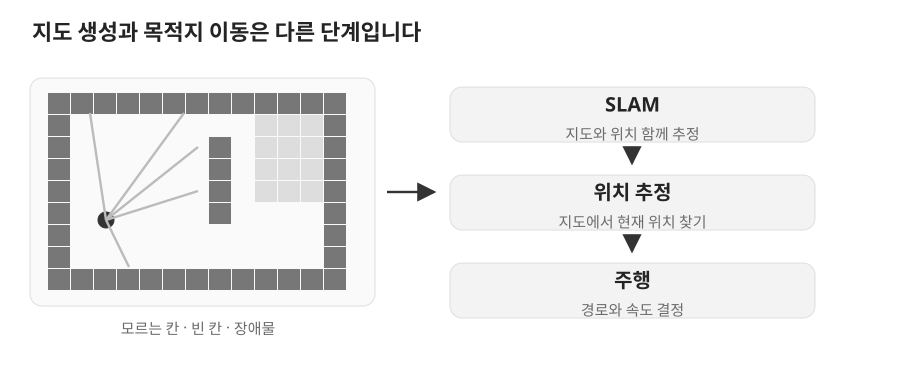

# 06. SLAM과 Navigation

> 목표: 지도·위치 추정·주행을 구분하고, Cleany의 sensor bridge부터 두 SLAM backend의 설정과 출력까지 따라갑니다.

## 06.1 SLAM과 점유 격자

이동 로봇은 세 가지 질문에 답해야 합니다. **지도 작성**은 주변 공간이 어떻게 생겼는지, **위치 추정**은 지도에서 어디에 있는지, **Navigation**은 목적지까지 어느 경로와 속도로 갈지를 다룹니다.

**SLAM**은 지도를 만들면서 자신의 위치도 추정하는 문제입니다. LiDAR는 방향별 거리를 측정하고, SLAM은 이동량과 센서 관측을 함께 사용합니다. **점유 격자**(occupancy grid)는 공간을 작은 칸으로 나누어 장애물·빈 공간·미관측 공간을 표현합니다.



*학습용 지도 예시 · 실제 Cleany 측정 지도와 경로가 아닙니다.*

지도는 벽 위치를 보여주지만 로봇이 얼마나 가까이 갈지는 결정하지 않습니다. 주행에서는 로봇 크기와 장애물 여유를 고려하는 **costmap**, 경로 계획기, 속도 제어와 도착 판정이 필요합니다. Nav2는 이런 주행 구성 요소를 제공하는 ROS 2 스택입니다.

## 06.2 Gazebo 센서 입력과 TF 계약

Cleany의 SLAM 데이터 경로는 아래 순서로 읽을 수 있습니다.

```text
Gazebo LiDAR → ros_gz_bridge → /scan ─────────────┐
Gazebo ground-truth → /gazebo_odom → /odom ───────┤ SLAM → /map
                          └→ odom → base_link TF ┤      → map → odom TF
sensor_tf_publisher → base_link → lidar_link TF ─┘
```

[bridge/navigation_bridge.yaml](../../../ros2_ws/src/cleany_gazebo_sim/config/bridge/navigation_bridge.yaml)은 ROS/Gazebo 메시지 타입과 토픽 이름을 연결합니다. [odom_tf_publisher.py](../../../ros2_ws/src/cleany_gazebo_sim/cleany_gazebo_sim/odom_tf_publisher.py)는 입력의 pose와 시각을 재사용해 `/odom`과 TF를 제공합니다. [base.yaml](../../../ros2_ws/src/cleany_gazebo_sim/config/base.yaml)은 센서 frame과 장착 관계를 정합니다.

SLAM은 scan이 관측된 시각에 로봇과 LiDAR가 어디 있었는지 알아야 합니다. `/scan` 토픽만 있어도 TF나 시간이 틀리면 처리할 수 없습니다. 시뮬레이터의 `/clock`과 SLAM의 `use_sim_time`도 맞춰야 합니다.

**이 경로의 odometry는 ground-truth 기반입니다.** 실물 encoder로 누적한 오차나 바퀴 미끄러짐을 평가하는 입력이 아닙니다. 지도 생성 결과를 실물 odometry 성능으로 해석하지 마세요.

## 06.3 slam_toolbox 설정과 Lifecycle

[cleany_navigation](../../../ros2_ws/src/cleany_navigation/README.md)은 SLAM 알고리즘을 새로 구현하기보다 외부 노드를 실행하는 launch와 설정을 제공합니다. [slam_mapping.launch.py](../../../ros2_ws/src/cleany_navigation/launch/slam_mapping.launch.py)는 `async_slam_toolbox_node`를 `LifecycleNode`로 만들고 설정 파일과 launch 인자를 전달합니다.

[slam_toolbox.yaml](../../../ros2_ws/src/cleany_navigation/config/slam/slam_toolbox.yaml)의 실제 입력 계약은 다음과 같습니다.

```yaml
odom_frame: odom
map_frame: map
base_frame: base_link
scan_topic: /scan
mode: mapping
use_map_saver: true
use_sim_time: false
```

launch에서 `use_sim_time:=true`를 주면 YAML의 기본값 위에 적용됩니다. 설치된 package share의 설정을 읽으므로 소스 YAML을 바꾼 뒤에는 프로젝트의 빌드 절차와 install 방식을 확인해야 합니다.

**Lifecycle** 노드는 설정과 실행 상태를 나눕니다. 이 launch는 `CONFIGURE` 이벤트를 보내고, `configuring → inactive`가 되면 `ACTIVATE` 이벤트를 보냅니다. 프로세스가 살아 있어도 active가 아니면 정상 매핑과는 다릅니다.

주요 설정을 목적별로 읽으면 긴 YAML도 이해하기 쉽습니다.

| 설정 | 현재 값 | 읽는 관점 |
| --- | --- | --- |
| `resolution` | 0.05 | 지도 한 칸의 크기, m |
| `map_update_interval` | 2.0 | 지도 갱신 간격, s |
| `transform_publish_period` | 0.05 | TF 발행 주기, s |
| `scan_queue_size` | 1 | 지연 scan의 대기열을 작게 유지 |
| `minimum_travel_distance` | 0.10 | 이동량 기준, m |
| `minimum_travel_heading` | 0.10 | 회전량 기준, rad |
| `min_laser_range`, `max_laser_range` | 0.15, 12.0 | 사용할 거리 범위, m |
| `do_loop_closing` | true | 재방문 구간을 연결해 지도 오차 보정 |

**Loop closure**는 이전에 본 장소를 다시 인식해 누적 오차를 보정하는 과정입니다. `loop_search_maximum_distance` 등 일부 값은 launch 인자로도 변경됩니다. 이 profile은 비교 후보이며 저장소의 설정만으로 알고리즘 선택이나 실물 정확도가 확정된 것은 아닙니다.

## 06.4 Cartographer의 Submap과 출력

다른 실행 경로는 [cartographer_mapping.launch.py](../../../ros2_ws/src/cleany_navigation/launch/cartographer_mapping.launch.py)와 [cartographer_2d.lua](../../../ros2_ws/src/cleany_navigation/config/slam/cartographer_2d.lua)입니다. Cartographer는 관측을 작은 **submap**에 쌓고 pose graph로 submap과 로봇 위치 사이 관계를 최적화합니다.

Lua 설정의 TF·입력 부분은 다음과 같습니다.

```lua
map_frame = "map",
tracking_frame = "base_link",
published_frame = "odom",
odom_frame = "odom",
provide_odom_frame = false,
publish_frame_projected_to_2d = true,
use_pose_extrapolator = true,
use_odometry = true,
```

`provide_odom_frame=false`이므로 이 설정에서는 외부의 `odom → base_link` 관계를 사용합니다. slam_toolbox의 frame 계약과 비교하면 같은 TF 역할을 다른 설정 문법으로 표현한다는 점을 볼 수 있습니다.

launch는 `scan`을 `/scan`, `imu`를 `/imu/data`로 remap하지만 현재 Lua의 `TRAJECTORY_BUILDER_2D.use_imu_data=false`입니다. **remap이 있다는 것과 실제 estimator가 그 센서를 사용한다는 것은 다릅니다.**

또한 launch에는 `cartographer_node`와 `cartographer_occupancy_grid_node` 두 노드가 있습니다. 앞 노드는 추정과 submap을 담당하고, 뒤 노드는 이를 ROS 점유 격자 `/map`으로 제공합니다. 현재 grid 설정은 0.05m 해상도와 2초 발행 주기입니다. 알고리즘을 비교할 때는 두 backend에 같은 입력·시간·TF를 주고, 지도 출력과 추정 상태를 함께 봐야 합니다.

## 06.5 SLAM 출력과 Navigation 경계

현재 이 baseline의 `cleany_navigation`에는 SLAM launch가 있고 통합 AMCL·Nav2 주행 launch는 아직 없습니다. AMCL은 기존 지도에서 위치를 추정하는 대표적인 방식이고, Nav2 주행은 목적지 action을 받아 계획·제어를 수행하는 다음 계층입니다.

Gazebo의 [ground_truth_route_follower.py](../../../ros2_ws/src/cleany_gazebo_sim/cleany_gazebo_sim/ground_truth_route_follower.py)는 ground-truth를 이용한 별도 시험 도구입니다. 이 도구로 경로를 따라갔다고 SLAM 기반 localization과 Nav2 목적지 주행이 연결된 것으로 볼 수는 없습니다.

문제를 찾을 때는 관측 범위를 단계별로 좁힙니다.

| 증상 | 먼저 볼 부분 |
| --- | --- |
| `/scan`이 없음 | Gazebo sensor profile, bridge |
| scan은 있는데 처리되지 않음 | frame ID, TF 경로, timestamp, Lifecycle |
| 지도 표시가 늦음 | 갱신 주기, 처리 지연, 입력 상태 |
| Cartographer submap은 있는데 `/map`이 없음 | occupancy grid 노드 |
| `/map`은 있는데 목적지 이동이 안 됨 | navigation 계층의 실행·연결 여부 |

지도 품질 비교에는 같은 경로와 관측 조건이 필요합니다. 숫자를 튜닝했다고 실제 개선을 입증한 것은 아니며, ground-truth 환경의 결과와 실물 결과도 나눠 기록해야 합니다.

## 06.6 SLAM 관찰 실습

ROS Humble 설치와 package 빌드가 필요합니다. 준비 과정은 [workspace README](../../../ros2_ws/README.md)와 [Gazebo README](../../../ros2_ws/src/cleany_gazebo_sim/README.md)를 따릅니다. 실제 로봇과 연결하지 않은 독립된 시뮬레이션 환경에서 수행하세요.

첫 터미널에서 센서가 있는 가상 공간을 실행합니다.

```bash
source /opt/ros/humble/setup.bash
make sim-gazebo
```

두 번째 터미널에서 slam_toolbox를 시작합니다.

```bash
source /opt/ros/humble/setup.bash
source ros2_ws/install/setup.bash
ros2 launch cleany_navigation slam_mapping.launch.py use_sim_time:=true
```

세 번째 터미널에서도 같은 setup을 적용하고 확인합니다.

```bash
ros2 topic list
ros2 lifecycle get /slam_toolbox
ros2 topic echo /map --once --field info
ros2 run tf2_ros tf2_echo odom base_link
```

`/scan`, `/odom`, `/map`, active 상태와 TF 연결을 확인하세요. map의 `resolution`은 이 profile에서 0.05여야 합니다. 지도 크기는 관측된 영역에 따라 달라집니다. 정지 상태에서도 초기 지도는 관찰할 수 있으며 이 실습에서는 속도 명령을 보내지 않습니다.

비교하고 싶다면 먼저 SLAM 터미널을 `Ctrl-C`로 종료한 뒤 Cartographer launch를 실행합니다. 두 SLAM을 동시에 실행하면 `/map`과 `map → odom` 발행 주체가 중복될 수 있습니다.

```bash
ros2 launch cleany_navigation cartographer_mapping.launch.py use_sim_time:=true
ros2 topic list
ros2 topic echo /map --once --field info
```

끝나면 각 실행 터미널에서 `Ctrl-C`를 누릅니다. ROS가 없으면 두 launch와 YAML/Lua에서 입력, TF, 출력 grid 노드를 표시하는 코드 읽기 실습을 수행하세요.

**확인 질문:** scan remap, IMU 사용 설정, grid 노드 중 어느 파일을 바꿔야 하는지 설명할 수 있나요? `/map`이 생긴 사실만으로 아직 알 수 없는 것은 무엇인가요?

<details><summary>생각을 비교해 보기</summary>

Cartographer remap과 grid 노드는 launch에, 실제 IMU 사용은 Lua에 있습니다. 지도 생성만으로 목적지 action, 경로 계획, 속도 제어와 도착 판정은 검증되지 않습니다.

</details>

더 읽기: [slam_toolbox 공식 저장소](https://github.com/SteveMacenski/slam_toolbox), [Nav2 공식 개념 설명](https://docs.nav2.org/rolling/getting_started/navigation_concepts/). Nav2 링크는 Rolling 개념 참고이며 설치·실행은 프로젝트의 Humble README를 따릅니다.
