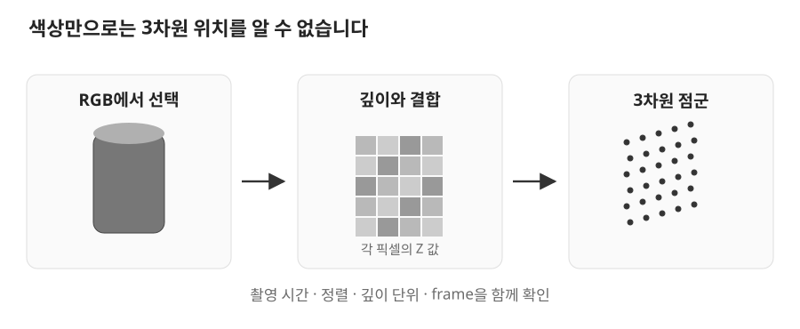

# 07. RGB-D와 점군

> 목표: RGB-D 입력부터 base frame 점군과 파지 요청까지 실제 데이터가 바뀌는 과정을 추적합니다.

## 07.1 RGB-D 입력

사진에서 물체를 찾았다고 팔이 갈 위치를 바로 알 수는 없습니다. 사진의 위치는 `(가로 픽셀, 세로 픽셀)`이고 팔에는 3차원 위치가 필요합니다. **RGB-D**는 색상 영상(RGB)과 깊이(depth)를 함께 제공하는 입력입니다.



*분할과 투영의 학습용 예시 · 실제 검출 결과가 아닙니다.*

**탐지**(detection)는 물체의 위치나 종류를 찾고, **분할**(segmentation)은 그 물체에 속하는 픽셀을 고릅니다. 선택한 픽셀을 표시하는 **mask**에 깊이를 결합하면 물체 표면의 3차원 점들을 얻습니다. 이 점들의 집합이 **점군**(point cloud)입니다.

색상과 깊이 영상의 같은 픽셀이 같은 공간을 보아야 합니다. 깊이의 단위도 확인해야 합니다. 이 장의 순수 함수는 입력 이름부터 `depth_m`으로 미터 단위를 요구합니다.

## 07.2 Cleany의 인식 경로

현재 `cleany_perception`은 scaffold입니다. 범용 인식 파이프라인의 인터페이스와 빨간 캔 데모의 실행 가능한 코드를 구분해서 읽습니다.

| 경로 | 실제 책임 |
| --- | --- |
| [cleany_interfaces](../../../ros2_ws/src/cleany_interfaces/README.md) | 인식 결과·snapshot·파지 요청의 메시지 계약 |
| [can_grasp_execution_demo.py](../../../ros2_ws/src/cleany_skill_executor/cleany_skill_executor/can_grasp_execution_demo.py) | MuJoCo 영상 수신, 변환, 서비스 요청을 연결 |
| [core/can_rgbd.py](../../../ros2_ws/src/cleany_skill_executor/cleany_skill_executor/core/can_rgbd.py) | ROS 없이 빨간 캔 분할과 점군 투영 |

데모의 `run()`은 `color, depth, info`를 기다린 뒤 `_rgb_array()`와 `_depth_array()`로 배열을 만듭니다. `_camera_projection()`으로 카메라 파라미터를 만들고 `segment_red_can()`에 전달합니다.

`CameraProjection`에는 내부 파라미터 `fx, fy, cx, cy`와 optical frame에서 base로 가는 회전·이동이 들어 있습니다. `SegmentedCanCloud`는 `target_points`, `target_colors`, `context_points`, `context_colors`를 반환합니다. ROS 메시지 처리는 바깥 노드에 있고 계산은 작은 모델과 함수로 분리되어 있습니다.

## 07.3 분할과 유효 깊이

다음은 `segment_red_can()`의 연속된 실제 발췌입니다. 앞뒤 입력 검증과 반환 부분은 생략했습니다.

```python
finite = np.isfinite(depth_m) & (depth_m > 0.1) & (depth_m < 3.0)
red = rgb[:, :, 0].astype(float)
green = rgb[:, :, 1].astype(float)
blue = rgb[:, :, 2].astype(float)
target_mask = (
    finite
    & (red > 140.0)
    & (red > 1.55 * green)
    & (red > 1.70 * blue)
)
```

깊이가 유효하고 빨강 성분이 충분히 강한 픽셀만 남깁니다. 학습한 모델로 임의의 물체를 찾는 YOLO 경로가 아닙니다. 빨간 캔 시뮬레이션에 한정된 색상 조건입니다.

`np.nonzero(target_mask)`로 선택된 행·열을 얻습니다. 기본값 `minimum_target_pixels=100`보다 적으면 `ValueError`가 발생합니다. RGB가 `H×W×3`인지, depth가 같은 `H×W`인지도 먼저 검사합니다. 색이 보이더라도 깊이가 비어 있으면 이 경로의 3차원 위치는 만들 수 없습니다.

**context**는 target의 픽셀 범위에 기본 `context_margin_pixels=80`을 더한 주변 영역입니다. target만 있으면 캔은 설명할 수 있어도 주변 책상과 손가락의 관계를 검사하기 어렵습니다. 계산량을 제한하는 기본 점 수는 target 12,000개, context 30,000개이며 `_limited_indices()`가 샘플을 고릅니다.

## 07.4 카메라 투영과 좌표 변환

카메라 내부 파라미터는 픽셀을 optical frame 점으로 바꿉니다. `_project()`의 연속된 실제 본문을 읽어봅시다.

```python
z = depth[rows, columns]
optical = np.column_stack(
    (
        (columns - camera.cx) * z / camera.fx,
        (rows - camera.cy) * z / camera.fy,
        z,
    )
)
rotation = np.asarray(camera.rotation_base_from_optical).reshape((3, 3))
translation = np.asarray(camera.translation_base)
return optical @ rotation.T + translation
```

앞부분은 `X=(u-cx)Z/fx`, `Y=(v-cy)Z/fy`입니다. 여기서 `Z`는 optical 전방축 깊이입니다. 뒷부분은 그 점들을 로봇의 기준 좌표로 옮깁니다. 각 점이 배열의 행으로 저장되어 있어서 곱에 `rotation.T`가 사용됩니다.

작은 계산으로 깊이의 효과를 확인합니다. 저장소 루트에서 실행할 수 있고 센서 연결은 필요 없습니다.

```bash
python3 - <<'PYTHON'
u, v = 370, 240
fx, fy, cx, cy = 500, 500, 320, 240
for z in (1.0, 2.0):
    print(((u-cx)*z/fx, (v-cy)*z/fy, z))
PYTHON
```

결과는 `(0.1, 0.0, 1.0)`, `(0.2, 0.0, 2.0)`입니다. 같은 픽셀이라도 깊이가 다르면 3차원 위치가 다릅니다. 이것은 투영 식의 예시이며 실제 측정 결과가 아닙니다.

## 07.5 Frame·timestamp·snapshot 계약

좌표값만 전달하면 언제, 어디서 측정했는지 잃어버립니다. 데모의 `_on_camera()`는 ROS `header.stamp`의 초·나노초를 키로 사용합니다. 다음은 그 함수의 연속된 실제 발췌입니다.

```python
key = (message.header.stamp.sec, message.header.stamp.nanosec)
sample = self._camera_messages.setdefault(key, {})
sample[kind] = message
if {'color', 'depth', 'info'} <= sample.keys():
    self._rgbd_frame = (
        sample['color'], sample['depth'], sample['info']
    )
    self._camera_messages.clear()
```

같은 stamp에 세 입력이 모여야 사용합니다. 서로 가까운 시간을 자동으로 짝짓는 근사 동기화가 아니므로, 다른 카메라를 연결할 때는 이 조건부터 확인해야 합니다.

`run()`은 색상 stamp로 `mujoco-can-...` snapshot ID를 만들고, 두 점군을 `PointCloud2`로 변환해 `PlanGrasp`에 보냅니다. `_cloud_message()`는 촬영 stamp를 보존하고 `frame_id='base_link'`를 기록합니다. 앞 절에서 이미 점을 base 좌표로 변환했기 때문에 붙이는 frame입니다.

일반 인터페이스인 [DetectedObject3DArray.msg](../../../ros2_ws/src/cleany_interfaces/msg/DetectedObject3DArray.msg)는 `header`, `snapshot_id`, `objects`를 담습니다. 개별 [DetectedObject3D.msg](../../../ros2_ws/src/cleany_interfaces/msg/DetectedObject3D.msg)의 `obb_pose`와 `obb_size`는 배열 header의 frame을 공유합니다. **OBB**는 방향을 가진 경계 상자이고 크기의 단위는 m입니다. 데모는 이 계약 전체를 제공하는 일반 `InspectScene` 서버 대신 직접 `PlanGrasp` 요청을 구성합니다.

## 07.6 점군에서 파지 요청까지 추적

파일을 열고 다음 경로를 한 번 따라가 보세요. 실행 없이 읽기만 해도 됩니다.

```text
_on_camera() → _wait_for_rgbd()
→ _rgb_array() / _depth_array() / _camera_projection()
→ segment_red_can() → _project()
→ _target_object() / _cloud_message()
→ PlanGrasp 요청 → /grasp/plan
```

1. `segment_red_can()`에서 깊이 제한과 최소 픽셀 조건을 찾습니다.
2. `_cloud_message()`에서 stamp와 frame이 어디서 왔는지 설명합니다.
3. `run()`에서 `target_cloud`와 `context_cloud`가 따로 채워지는 부분을 찾습니다.

**확인 질문:** 분할은 성공했는데 파지 위치가 옆으로 어긋난다면 어디부터 확인할까요?

<details><summary>생각을 비교해 보기</summary>

먼저 RGB·depth 정렬과 단위, 카메라 내부 파라미터를 확인합니다. 그다음 optical→base 변환과 stamp를 봅니다. 분할 성공은 mask 조건의 성공이고, 그 뒤 투영과 좌표 변환까지 정확하다는 증거는 아닙니다. 파지 후보 생성은 다음 장의 별도 단계입니다.

</details>

데모의 실행 전제와 현재 범위는 [Skill Executor README](../../../ros2_ws/src/cleany_skill_executor/README.md)에서 확인합니다.
