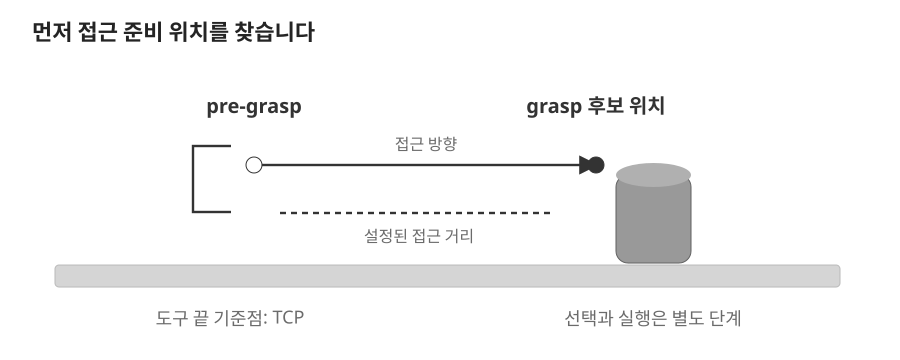

# 08. Grasp와 MoveIt

> 목표: 점군에서 파지 후보를 만들고, 양팔의 도달 가능성을 평가하고, 실행 범위를 구분합니다.

## 08.1 Grasp·TCP·IK

물체의 가운데가 잡기 좋아 보여도 팔이 닿지 않거나 움직이는 중 책상에 부딪힐 수 있습니다. **파지**(grasp) 후보는 잡을 위치·방향·그리퍼 벌림 폭의 제안입니다. **TCP**(Tool Center Point)는 도구 끝을 대표하는 기준점이고, **IK**(Inverse Kinematics, 역기구학)는 목표 TCP에 대응하는 관절값을 구합니다.



*위치와 접근 방향의 개념도 · 팔의 실제 경로와 축척은 생략했습니다.*

**pre-grasp**는 물체에 닿기 전의 접근 준비 위치입니다. 준비 위치까지 가는 구간과 물체로 접근하는 구간을 나눕니다. **MoveIt**은 로봇 모델과 현재 관절 상태를 사용해 IK, 충돌 검사, 동작 계획 등을 제공하는 도구입니다.

이 장의 핵심은 세 질문을 나눠 읽는 것입니다. “어디를 잡을까?”, “그곳까지 갈 수 있을까?”, “선택한 계획을 실행했을까?”의 답은 서로 다른 코드에서 나옵니다.

## 08.2 후보 생성과 데이터 모델

| 단계 | 구현 위치 | 입력 → 출력 |
| --- | --- | --- |
| 형상 기반 후보 생성 | [geometric_predictor.py](../../../ros2_ws/src/cleany_grasping/cleany_grasping/geometric_predictor.py) | target/context 점군 → `RawGrasp` |
| 필터·정렬 | [core/selector.py](../../../ros2_ws/src/cleany_grasping/cleany_grasping/core/selector.py) | `RawGrasp` → `GraspPose` |
| ROS 서비스 | [grasp_node.py](../../../ros2_ws/src/cleany_grasping/cleany_grasping/grasp_node.py) | `PlanGrasp` 요청 → 후보 메시지 |
| 양팔 도달 평가 | [core/grasp_selection.py](../../../ros2_ws/src/cleany_skill_executor/cleany_skill_executor/core/grasp_selection.py) | `Candidate` → `Selection` 또는 없음 |

[models.py](../../../ros2_ws/src/cleany_grasping/cleany_grasping/core/models.py)의 `PointCloud`는 점과 색을 각각 `N×3` 배열로 보관합니다. `RawGrasp`는 회전 행렬, 위치, 폭·깊이(m), score를 담습니다. 후보 생성기의 표현을 TCP 기준으로 바꾼 것이 `GraspPose`입니다.

형상 기반 predictor는 context 점군에서 지지 평면을 추정하고 target의 접선 방향과 폭을 살펴 위에서 접근하는 평행 그리퍼 후보를 만듭니다. `GeometricGraspConfig`에는 폭 한계, 손가락 크기, 충돌 여유, 탐색 각도와 후보 수가 있습니다. 이 점군 수준 검사가 로봇 팔 전체의 MoveIt 충돌 검사를 대신하지는 않습니다.

AnyGrasp 연결도 [anygrasp_adapter.py](../../../ros2_ws/src/cleany_grasping/cleany_grasping/anygrasp_adapter.py)에 있지만 실제 backend와 필요한 SDK 조건은 [Grasping README](../../../ros2_ws/src/cleany_grasping/README.md)를 확인해야 합니다. 데모의 형상 기반 후보와 학습 모델 출력을 동일한 것으로 읽지 마세요.

## 08.3 후보 필터와 TCP 변환

다음은 `rank_grasps()`에서 연속된 실제 발췌입니다. 중복 후보 제거와 TCP 변환 부분은 뒤에 이어집니다.

```python
contact_min = target_min - settings.target_contact_margin_m
contact_max = target_max + settings.target_contact_margin_m
for candidate in sorted_candidates:
    if not 0.0 < candidate.width_m <= settings.maximum_gripper_width_m:
        continue
    contact = candidate.translation + candidate.depth_m * candidate.rotation[:, 0]
    if not np.all((contact >= contact_min) & (contact <= contact_max)):
        continue
```

폭 한계를 넘는 후보와 접촉점이 target 범위 밖에 있는 후보를 제거합니다. 후보 위치 자체가 아니라 접근 깊이를 더한 접촉점을 검사한다는 점을 보세요.

뒤에서는 **NMS**(Non-Maximum Suppression, 중복 후보 억제)를 수행합니다. 위치와 회전이 모두 비슷한 후보는 남긴 후보와 겹치는 것으로 보고 제거합니다. 기본 거리 한계는 0.02 m, 각도 한계는 20°입니다. 이후 `canonical_to_tcp_rotation`으로 회전을 바꾸고 `tcp_approach_axis`로 접근 방향을 계산합니다.

score 순위가 높다는 것은 후보 생성기의 우선순위입니다. 현재 관절 상태에서 갈 수 있다는 뜻은 아닙니다. 이제 그 검사가 `cleany_skill_executor`로 넘어갑니다.

## 08.4 양팔 선택과 MoveIt 호출

`GraspSelectionConfig`는 기본 접근 거리 `pregrasp_offset_m=0.08`과 최대 검사 후보 `maximum_candidates=12`를 둡니다. `select()`는 score 순으로 후보를 정렬하고 각 후보에 대해 팔을 순차 검사합니다. 후보 Y가 양수이면 왼팔, 음수이면 오른팔이 먼저입니다.

`pregrasp_position()`은 접근 벡터를 정규화하고 `목표 위치 − 접근 방향 × 거리`를 계산합니다. 저장소 루트에서 실제 함수를 호출해 보세요. ROS 연결은 필요 없습니다.

```bash
PYTHONPATH=ros2_ws/src/cleany_skill_executor python3 - <<'PYTHON'
from cleany_skill_executor.core.grasp_selection import Candidate, GraspSelector
candidate = Candidate((0.4, 0.1, 0.2), (0.0, 0.0, -1.0), 0.9)
print(GraspSelector.pregrasp_position(candidate, offset_m=0.08))
print(GraspSelector.arm_order(candidate))
PYTHON
```

결과는 `(0.4, 0.1, 0.28)`과 `('left', 'right')`입니다. 아래로 접근하므로 준비 위치가 더 높습니다.

`select()`의 순서를 호출 이름으로 정리하면 다음과 같습니다. 아래는 원문 발췌가 아닌 흐름 요약입니다.

```text
후보·팔 선택
→ solve_position_ik(pregrasp)
→ solve_position_ik(grasp, seed=pregrasp)
→ state_is_valid(pregrasp), state_is_valid(grasp)
→ plan(현재 상태 → pregrasp)
→ plan(pregrasp → grasp)
→ Selection 반환
```

이 순수 core는 `ReachabilityPort`에 요청하고, [moveit_adapter.py](../../../ros2_ws/src/cleany_skill_executor/cleany_skill_executor/moveit_adapter.py)가 ROS/MoveIt 서비스를 연결합니다. `set_target_contacts()`는 준비 단계와 접촉 단계의 허용 접촉 조건을 바꿉니다. 목표 물체와의 제한된 접촉 허용은 주변 전체의 충돌 검사를 해제한다는 뜻이 아닙니다.

## 08.5 계획·실행·실패 경계

`select()` 후반의 연속된 실제 발췌입니다. pre-grasp 계획을 통과한 다음에도 grasp 구간 계획이 남습니다.

```python
self._port.set_target_contacts(arm)
feedback(index, arm, EvaluationStage.PLAN_GRASP, 'planning')
grasp_is_planned = self._port.plan(arm, grasp, pregrasp)
check_canceled()
if not grasp_is_planned:
    continue
return Selection(index, arm, candidate, pregrasp, grasp)
```

한 후보·팔 조합이 IK나 계획에서 실패하면 다음 조합을 검사합니다. 모두 실패하면 `None`입니다. 취소 요청은 `InterruptedError`로 중단합니다. `InfrastructureError`는 통신·MoveIt 기반 실패를 나타내므로 단순히 다른 후보로 바꾸어 계속 평가할 상황과 구분됩니다.

[SelectReachableGrasp.action](../../../ros2_ws/src/cleany_interfaces/action/SelectReachableGrasp.action)은 **plan-only**입니다. 선택과 계획 검사를 수행하고 팔 trajectory를 직접 실행하지 않습니다. 운영 action의 IK도 **position-only**이므로 TCP 방향까지 만족했다는 의미가 아닙니다.

별도 [can_grasp_execution_demo.py](../../../ros2_ws/src/cleany_skill_executor/cleany_skill_executor/can_grasp_execution_demo.py)는 후보 선택 후 방향 보정을 거쳐 pre-grasp까지 이동합니다. 이 데모 범위에 gripper close·물체 attach·lift는 포함되지 않습니다. 따라서 후보 그림, action 성공, 팔 이동 각각의 관찰이 어떤 단계를 입증하는지 나눠 읽습니다.

## 08.6 파지 파이프라인 추적

다음 순서로 파일을 열고 각 화살표에서 데이터 형식을 적어보세요.

```text
PlanGrasp → grasp_node → predictor → rank_grasps
→ GraspCandidate[] → SelectReachableGrasp
→ GraspSelector.select() → ReachabilityPort → MoveIt
→ 선택 결과 → 데모의 별도 이동 단계
```

1. `RawGrasp.width_m`가 어디에서 걸러지는지 찾습니다.
2. `GraspSelector.select()`에서 `continue` 하나를 골라 어떤 실패인지 설명합니다.
3. score가 1등인 후보가 탈락하고 다른 팔이 선택되는 상황을 말로 만들어봅니다.

**확인 질문:** 시작점과 끝점의 관절 상태가 모두 충돌하지 않으면 경로 계획을 생략할 수 있을까요?

<details><summary>생각을 비교해 보기</summary>

두 끝점 사이의 움직임이 주변 물체를 통과할 수 있습니다. 상태 유효성 검사와 경로 계획은 서로 다른 질문에 답합니다. 계획 성공도 실제 파지·들기 성공을 의미하지 않습니다.

</details>
