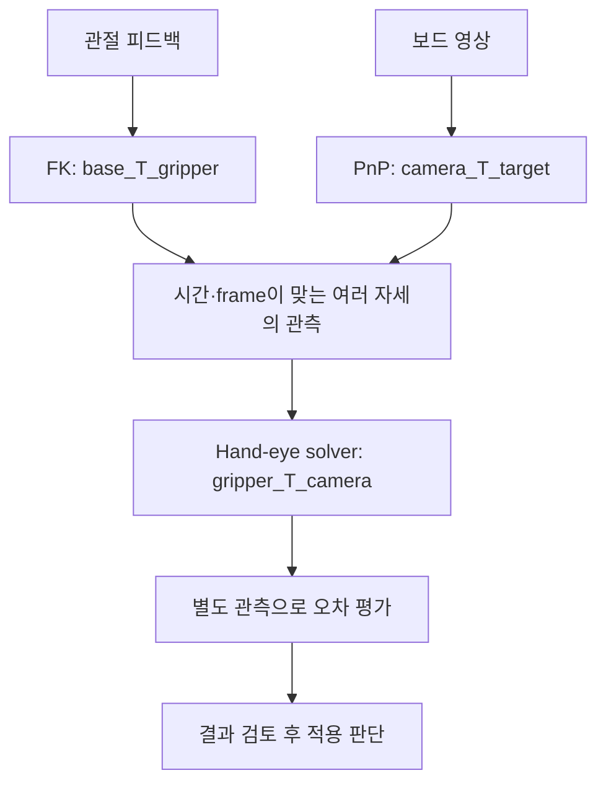

# 09. Hand-eye Calibration

> 목표: 영상과 관절 피드백의 동기화부터 PnP, 보정 solver, 독립 평가까지 코드의 연결을 이해합니다.

## 09.1 Eye-in-hand 구성

설계 파일의 센서 위치는 실제 조립 위치와 조금 다를 수 있습니다. **보정**(calibration)은 측정을 사용해 모델의 관계나 파라미터를 추정하는 과정입니다. 손목과 카메라 사이 관계를 찾는 작업이 **hand-eye calibration**입니다.

앞 장의 고정 카메라 캔 데모와 이번 장의 카메라는 다릅니다. [cleany_handeye_calibration](../../../ros2_ws/src/cleany_handeye_calibration/README.md)은 **왼팔 손목 카메라**의 eye-in-hand 경로를 다룹니다. 팔이 움직이면 카메라도 움직이고 관측 보드는 고정되어 있습니다.



*입력과 출력의 개념도 · 실제 보정 결과를 표시하지 않습니다.*

**FK**(Forward Kinematics, 정기구학)는 관절값으로 팔 끝 위치·방향을 계산합니다. **PnP**(Perspective-n-Point)는 실제 크기를 아는 보드의 점과 영상의 점을 대응시켜 카메라와 보드의 상대 자세를 구합니다. **ChArUco**는 코너를 식별할 수 있는 보정 보드입니다.

## 09.2 변환과 데이터 모델

[transforms.py](../../../ros2_ws/src/cleany_handeye_calibration/cleany_handeye_calibration/transforms.py)의 `RigidTransform`은 `parent_T_child`를 나타냅니다. child 좌표의 점을 parent 좌표로 옮기는 관계입니다.

```text
base_T_gripper @ gripper_T_camera @ camera_T_target = base_T_target
```

보드의 점을 오른쪽부터 camera → gripper → base 순서로 옮긴다고 읽습니다. `@`는 변환을 이어 붙이는 행렬 곱입니다. 보정에서 찾는 값은 중간의 `gripper_T_camera`입니다.

| 모델·값 | 출처와 역할 |
| --- | --- |
| `TimedJointSample` | stamp(ns), 관절 이름, 피드백 위치(rad) |
| `InterpolatedJointState` | 영상 시각의 관절값과 보간에 사용한 전후 stamp |
| `base_T_gripper` | 동기화한 피드백을 사용한 FK |
| `camera_T_target` | 영상 코너의 PnP |
| `CalibrationSample` | 두 변환을 묶은 관측과 calibration/held-out 구분 |

[models.py](../../../ros2_ws/src/cleany_handeye_calibration/cleany_handeye_calibration/models.py)와 `RigidTransform.compose()`를 함께 보세요. 변환에는 숫자뿐 아니라 `parent_frame`, `child_frame`도 들어 있습니다. 잘못된 frame 사슬을 검사하기 위해서입니다.

## 09.3 관절 피드백과 영상 동기화

카메라는 팔이 움직이는 동안 촬영합니다. 명령한 관절값이나 나중에 받은 피드백을 영상에 연결하면 서로 다른 자세를 섞을 수 있습니다.

[joint_state_sync.py](../../../ros2_ws/src/cleany_handeye_calibration/cleany_handeye_calibration/joint_state_sync.py)의 `JointStateRingBuffer`는 시간순 피드백을 모읍니다. 기본 `DualArmJointContract`는 왼팔·오른팔 각 5개 관절과 각 gripper 피드백, 총 12개를 요구합니다. 보정은 왼팔을 대상으로 하지만 FK에 쓰는 로봇 상태는 양팔을 포함해야 합니다.

`interpolate()`에서 영상 시각을 감싸는 전후 샘플을 찾은 뒤 다음과 같이 계산합니다. 연속된 실제 발췌이며 뒤의 속도 보간과 결과 생성은 생략했습니다.

```python
ratio = before_distance_ns / (
    after.stamp_ns - before.stamp_ns
)
after_positions = dict(
    zip(after.joint_names, after.positions_rad, strict=True)
)
positions = tuple(
    before_position
    + ratio
    * (after_positions[name] - before_position)
    for name, before_position in zip(
        before.joint_names,
        before.positions_rad,
        strict=True,
    )
)
```

관절 이름으로 매칭하므로 메시지의 관절 배열 순서가 달라도 대응을 유지합니다. 전후 피드백이 없거나 너무 오래되면 `MISSING_BEFORE`, `MISSING_AFTER`, `STALE_BEFORE`, `STALE_AFTER` 같은 이유로 거부합니다. 버퍼는 설정된 `max_sample_distance_ns`를 검사하고, 큰 시간 역행은 clock reset으로 구분합니다.

작은 보간 계산을 해보세요. 실제 팔을 움직이지 않습니다.

```bash
python3 - <<'PYTHON'
before_ms, image_ms, after_ms = 100, 110, 120
q_before, q_after = 0.2, 0.4
ratio = (image_ms-before_ms)/(after_ms-before_ms)
print('ratio:', ratio)
print('joint rad:', q_before + ratio*(q_after-q_before))
PYTHON
```

결과는 ratio `0.5`, 관절 위치 약 `0.3 rad`입니다. 실제 구현은 ns 단위와 다수 관절, 입력 검증까지 다룹니다.

## 09.4 보드 검출과 PnP

[target_detector.py](../../../ros2_ws/src/cleany_handeye_calibration/cleany_handeye_calibration/target_detector.py)는 보드 코너를 찾고 [pnp.py](../../../ros2_ws/src/cleany_handeye_calibration/cleany_handeye_calibration/pnp.py)의 `solve_planar_pnp()`가 자세를 계산합니다. 카메라 내부 파라미터와 왜곡 계수, 실제 보드 점과 영상 점이 필요합니다.

이 함수는 OpenCV의 `solvePnPGeneric(..., flags=cv2.SOLVEPNP_IPPE)`로 평면 보드의 두 후보를 얻습니다. 각 후보에 대해 `evaluate_pnp_candidate()`가 깊이·유효성·재투영 오차를 검사하고 `select_pnp_candidates()`로 이어집니다.

**재투영 오차**는 계산한 3차원 보드 점을 영상으로 다시 투영했을 때 관측 코너와 얼마나 떨어지는지를 나타냅니다. 작은 오차만으로 모든 모호함이 사라지는 것은 아닙니다. 코드에는 `AMBIGUOUS_PNP`, 예상과 다른 후보 수, OpenCV 오류 등 별도 실패 이유가 있습니다.

[single_pose_orchestrator.py](../../../ros2_ws/src/cleany_handeye_calibration/cleany_handeye_calibration/single_pose_orchestrator.py)의 `SinglePoseOrchestrator.run()` 후반은 다음 순서로 읽습니다. 아래는 호출 흐름 요약입니다.

```text
영상 획득·보관
→ detect_target() : 코너와 PnP
→ compute_feedback_fk() : 영상 시각의 관절 피드백으로 FK
→ record_sample() : 관측과 출처를 함께 기록
```

앞부분에는 IK·계획·이동·정지 확인 단계도 있습니다. 이 장의 실습은 저장된 코드 읽기와 순수 계산으로 제한하고, 이 수집 runner는 실행하지 않습니다.

## 09.5 Hand-eye solver와 독립 평가

[solver.py](../../../ros2_ws/src/cleany_handeye_calibration/cleany_handeye_calibration/solver.py)의 `_prepare_opencv_inputs()`는 frame과 sample split을 검사합니다. calibration 표본만 solver 입력으로 허용하고, 최소 표본 수는 3입니다. 이는 입력 하한이고 세 표본이면 충분히 좋은 보정이 된다는 보장은 아닙니다.

`_run_method()`에서 OpenCV를 호출하는 연속된 실제 발췌입니다. 오류 처리와 출력 검증은 뒤에 이어집니다.

```python
method_inputs = inputs.copied_lists()
start_ns = time.perf_counter_ns()
try:
    output = cv_module.calibrateHandEye(
        method_inputs[0],
        method_inputs[1],
        method_inputs[2],
        method_inputs[3],
        method=method_constant,
    )
```

네 입력은 `base_T_gripper`의 회전·이동과 `camera_T_target`의 회전·이동입니다. registry에는 Tsai, Park, Horaud, Andreff, Daniilidis의 다섯 방법이 있습니다. 각 방법의 예외, 출력 형식, 변환 유효성을 구분해서 결과를 남깁니다.

보정에 쓴 자세만 다시 검사하면 입력에 잘 맞는지만 알 수 있습니다. 수집 경로는 20개 calibration과 5개 **held-out**(보정에 사용하지 않은 평가 자료)을 구분합니다. [experiment_evaluation.py](../../../ros2_ws/src/cleany_handeye_calibration/cleany_handeye_calibration/experiment_evaluation.py)의 `run_solver_experiment()`는 PnP·FK 자료 준비, solver 실행, 결과 평가를 연결합니다.

보드가 고정되어 있다면 held-out 표본에서 계산한 `base_T_target`도 서로 비슷해야 합니다. 이 일관성 오차와 시뮬레이션의 정답 대비 오차는 다른 지표입니다. MuJoCo ground truth는 평가용이며 solver에 넣지 않습니다. 평가 조건은 [evaluation.template.yaml](../../../ros2_ws/src/cleany_handeye_calibration/config/evaluation.template.yaml)과 패키지 README를 함께 읽습니다.

출력 보정 변환은 검토할 artifact입니다. 패키지가 결과를 자동으로 calibration TF에 적용하지는 않습니다.

## 09.6 보정 데이터 추적 실습

한 관측이 결과까지 가는 경로를 파일로 따라가 보세요.

```text
ROS 영상·관절 피드백
→ JointStateRingBuffer.interpolate()
→ 코너 검출 → solve_planar_pnp()
→ 피드백 FK → CalibrationSample
→ calibration split → solve_all_hand_eye_methods()
→ held-out / ground-truth 평가 → 결과 artifact
```

1. `interpolate()`에서 전후 표본이 오래되었을 때의 반환값을 찾습니다.
2. `_prepare_opencv_inputs()`에서 held-out 표본이 거부되는 부분을 찾습니다.
3. `RigidTransform.compose()`에서 연결되는 두 frame 이름을 확인합니다.
4. README의 평가 항목 중 held-out 일관성과 정답 대비 오차를 구분합니다.

**확인 질문:** 카메라와 gripper frame의 보정이 끝나면 실제 손가락의 잡기 위치도 검증된 걸까요?

<details><summary>생각을 비교해 보기</summary>

카메라↔gripper 변환, 모델의 TCP 위치, 실제 jaw 중심과 접촉은 각각 확인할 대상입니다. 이 보정은 카메라의 좌표 연결을 추정합니다. 물체를 실제로 잡고 들어올렸다는 결과까지 포함하지 않습니다.

</details>
