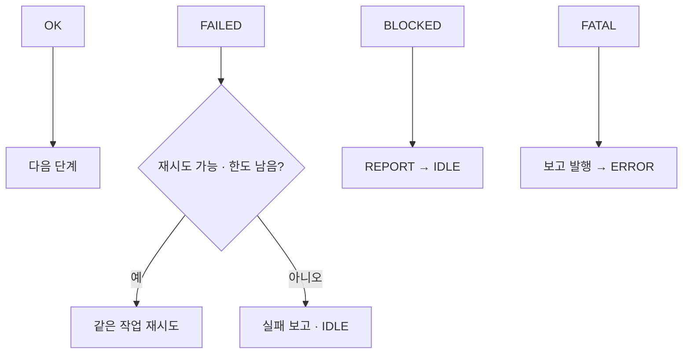

# 10. Mission FSM과 실패 처리

> 목표: 상태 전이, 재시도, 부분 완료와 최종 보고를 연결하고 모듈 adapter가 지켜야 할 계약을 설명합니다.

## 10.1 상태 전이와 책임

이동 실패와 작업 차단을 같은 방식으로 처리하면 위험하거나 허용되지 않은 작업을 반복할 수 있습니다. **FSM**(유한 상태 기계)은 현재 상태와 결과에 따라 다음 상태를 정합니다. Cleany의 순수 core에서는 Mission Manager가 전이 권한을 갖고 모듈은 결과를 반환합니다.



*Mission core의 처리 요약 · 직접 작성*

[states.py](../../../ros2_ws/src/cleany_mission_manager/cleany_mission_manager/core/states.py)를 [manager.py](../../../ros2_ws/src/cleany_mission_manager/cleany_mission_manager/core/manager.py)의 `step()`과 나란히 보세요. 상태 이름만 있는 enum과 실제 모듈을 호출하는 분기는 다른 역할입니다.

| 현재 상태 | 호출·처리 | 정상 이후 |
| --- | --- | --- |
| `NAVIGATE_TO_TARGET` | `navigate_to_target(request)` | `PERCEIVE` |
| `PERCEIVE` | `perceive(request)` | `PLAN_TASKS` |
| `PLAN_TASKS` | `plan(world_state)` | `EXECUTE_TASKS` |
| `EXECUTE_TASKS` | 해당 index의 `execute_skill()` | 다음 skill 또는 `RETURN_HOME` |
| `RETURN_HOME` | `return_home(request)` | `REPORT` |
| `REPORT` | 보고서 생성·발행 | `IDLE` |

## 10.2 ModuleResult와 오류 분류

[result.py](../../../ros2_ws/src/cleany_mission_manager/cleany_mission_manager/core/result.py)의 실제 결과 모델입니다.

```python
@dataclass(frozen=True)
class ModuleResult(Generic[T]):
    ok: bool
    status: ResultStatus
    failure_code: FailureCode | None = None
    retryable: bool = False
    message: str = ""
    data: T | None = None
```

`T`는 data에 담는 타입을 표현하는 기호입니다. 상태를 판단할 때 core가 읽는 값은 `status`이고, `failure_code`는 원인을, `retryable`은 재시도 가능 여부를 설명합니다. `ok`만 확인하는 adapter를 만들면 core의 실제 판단과 어긋날 수 있습니다.

제공된 `success()`, `failed()`, `blocked()`, `fatal()` 생성 함수를 사용하면 필드를 함께 구성할 수 있습니다. `FailureCode`에는 `NAVIGATION_FAIL`, `NO_OBJECTS`, `GRASP_FAIL`, `TIMEOUT`, `HARDWARE_ERROR` 등이 있습니다. 오류 코드는 어떤 모듈·조건에서 실패했는지 전달하기 위한 값이며 임의로 성공 상태로 바꾸지 않습니다.

## 10.3 재시도와 skill 진행 상태

`RetryPolicy`의 기본값은 상태당 재시도 1번, skill당 2번입니다. 재시도 수는 최초 시도와 별도입니다. 그래서 skill 재시도 한도가 2이면 해당 skill의 총 호출은 최대 3번입니다.

`_handle_non_ok_result()`의 실제 조건 발췌입니다.

```python
limit = retry_limit if retry_limit is not None else self.retry_policy.max_retries_per_state
if result.status == ResultStatus.FAILED and result.retryable and self._can_retry(retry_key, limit):
    self._record_retry(retry_key)
    return
```

세 조건이 동시에 필요합니다. `FAILED`, `retryable=True`, 해당 key의 남은 한도입니다. 재시도할 때 상태를 바꾸지 않고 다음 step에서 같은 역할을 다시 호출합니다.

상태별 key와 skill별 key는 다릅니다. `_execute_next_skill()`은 `skill:{next_skill_index}`를 사용합니다. 첫 skill이 성공하고 두 번째가 실패하면 index는 두 번째에 머무르고 첫 skill을 다시 실행하지 않습니다. 이를 확인하는 테스트는 [test_failed_skill_retries_only_that_skill_not_the_whole_plan](../../../ros2_ws/src/cleany_mission_manager/tests/test_mission_flow.py)입니다.

core의 재호출 정책이 실물 동작의 멱등성이나 복구 절차를 보장하지는 않습니다. 실제 adapter에는 “실패 응답 전에 어떤 물리 동작이 이미 일어났는가?”를 확인하는 처리가 필요합니다. 현재 mock은 그 물리 상태를 모델링하지 않습니다.

## 10.4 BLOCKED와 FATAL 경로

`BLOCKED`는 차단 보고를 만든 뒤 `REPORT`로 넘어갑니다. 재시도는 하지 않습니다. `FATAL`은 실패 보고서를 즉시 발행하고 `ERROR`에 머뭅니다. 차단과 치명적 오류를 서로 다른 전이로 다루는 이유입니다.

Python 모의 실습에서 확인합니다.

```bash
python3 docs/guide/examples/first_mission.py --scenario blocked
python3 docs/guide/examples/first_mission.py --scenario fatal
```

`blocked`는 Planner의 차단 응답이므로 `PLAN_TASKS -> REPORT -> IDLE`, 보고서는 `BLOCKED`입니다. `fatal`은 Navigator의 오류 응답이므로 `NAVIGATE_TO_TARGET -> ERROR`, 보고서는 `FAILED`입니다. 두 경우 모두 한 번 발행됩니다.

`reset()`은 `ERROR`일 때만 context를 초기화합니다. 현재 core의 reset은 로봇을 물리적으로 원위치로 보내는 함수가 아닙니다. 상태 초기화와 실제 장치의 정지·복구를 같은 동작으로 해석하지 않습니다.

## 10.5 부분 완료와 MissionReport

[models.py](../../../ros2_ws/src/cleany_mission_manager/cleany_mission_manager/core/models.py)의 `MissionReport`에는 상태 외에도 `completed_tasks`, `skipped_tasks`, `failed_task`, `needs_human_review`가 있습니다. 중간에 실패해도 이미 완료한 기록은 보고서에 남깁니다.

Planner의 `tasks` 중 `skip`과 `human_review`는 `_record_non_actionable_tasks()`에서 기록합니다. 최종 정상 경로의 상태를 정하는 실제 함수입니다.

```python
def _success_status(self) -> str:
    if self.context.needs_human_review:
        return "HUMAN_REVIEW_REQUIRED"
    if self.context.skipped_tasks:
        return "PARTIAL_SUCCESS"
    return "SUCCESS"
```

사람 검토가 필요하면 `HUMAN_REVIEW_REQUIRED`, 일부 건너뛰었다면 `PARTIAL_SUCCESS`입니다. 이 함수는 실패 보고가 아직 없는 정상 보고 경로에서 사용됩니다. 작업 목록이 남겼다는 사실과 물리적 완료를 확인했다는 사실도 구분해야 합니다.

최종 상태가 `IDLE`이라도 이전 보고서는 `FAILED`일 수 있습니다. 관제 adapter를 연결할 때 현재 상태만 보고 마지막 미션을 성공 표시하면 안 됩니다. 보고서의 상태·완료 목록·실패 위치를 함께 전달해야 합니다.

## 10.6 모듈 결과부터 보고서까지 추적

다음 네 함수를 찾아 한 실패 사례를 연결하세요.

```text
step() → 모듈 Port → ModuleResult
→ _handle_non_ok_result() → _make_report()
→ Reporter.publish() → REPORT/ERROR 이후 상태
```

1. [skill 실패 테스트](../../../ros2_ws/src/cleany_mission_manager/tests/test_mission_flow.py)의 `test_skill_retries_exhaust_and_preserve_partial_progress`를 엽니다.
2. `pick_object`가 성공하고 `place_object`가 세 번 실패하는 입력을 확인합니다.
3. 최종 `completed_tasks`, `failed_task`와 skill 호출 목록을 예상한 뒤 assert와 비교합니다.

이 커밋의 Mission Manager에는 공개 ROS 미션 topic·service·action과 Dashboard 수신 adapter가 없습니다. 실제 통합은 이 core 계약을 외부 통신에 연결하는 추가 구현이 필요합니다.

**확인 질문:** `retryable=True`만 보면 무조건 재시도해도 될까요?

<details><summary>생각을 비교해 보기</summary>

core는 FAILED 여부와 한도도 검사합니다. 실제 adapter에서는 이전 동작의 부분 수행·장치 상태까지 고려해야 합니다. 오류 의미를 보존한 채 결과를 반환하는 것이 모듈의 계약입니다.

</details>
