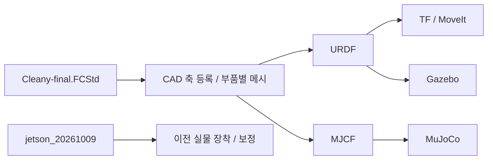

# Robot model 계약

기본 모델 `cad_final`은 `Cleany-final.FCStd`의 조립 형상을 사용한다. 외장, 팔과 링크형 그리퍼를 포함한 308개 CAD 부품을 공유하며, 실물 보정과 관성 추정은 별도다.

```mermaid
flowchart LR
  CAD[Cleany-final.FCStd] --> Export[CAD 축 등록 / 부품별 메시]
  Export --> URDF[URDF]
  Export --> MJCF[MJCF]
  URDF --> TF[TF / MoveIt]
  URDF --> Gazebo[Gazebo]
  MJCF --> MuJoCo[MuJoCo]
  Old[jetson_20261009] --> Cal[이전 실물 장착 / 보정]
```

[실행과 재생성](model-runtime.md) / [실물 캘리브레이션](../../../../docs/implementation/calibration.md)

## 조립 CAD와 구현 모델

<figure class="contract-figure" data-visual-id="cad-assembly">

<figcaption>Cleany-final.FCStd의 FreeCAD 조립 렌더. CAD의 등록 자세이며 encoder zero 자세나 실물 검증 화면은 아닙니다. <a href="../../../../docs/assets/visuals/imported.json">출처</a></figcaption>
</figure>

| 경로 | 현재 기준 |
|---|---|
| TF, MoveIt | `urdf/cad_final/geometry.xacro` |
| Gazebo 기본값 | 같은 URDF를 변환하는 `cad_frame`; navigation 설정은 팔 제외 |
| MuJoCo | `mjcf/cleany.xml`; 같은 부품별 메시와 관절 배치 |
| 이전 장착 | `model_profile:=jetson_20261009`; 이전 URDF, MJCF와 보정 자료 보존 |
| 예전 Gazebo 평가 형상 | `robot_model:=legacy`를 명시할 때만 사용 |

[형상 등록 정보](../config/geometry/cad_final.json)는 CAD 해시, 부품별 메시 해시, 좌표 변환과 조립 자세를 기록한다. 팔 장착점, 헤드, 그리퍼와 카메라 형상은 최신 CAD 기준이다. 팔의 관절 방향과 이름은 유지하며 CAD 조립 자세를 관절 영점으로 바꾸지 않는다.

## 좌표와 동작 범위

| 항목 | 계약 |
|---|---|
| Robot 축 | +X 전방, +Y 좌측, +Z 상방 |
| CAD → robot | X=−CAD Y, Y=CAD X, Z=CAD Z; mm→m |
| CAD 원점 → base_link | 위 회전 후 `(-0.000025, 0.000027, -0.284497)` m 이동 |
| Chassis 기준 높이 | 평지 정지 상태의 MuJoCo base 높이 0.38 m 유지 |
| Wheelbase / track / radius | 0.35 / 0.6038 / 0.0635 m; 실측 odometry 보정과 별도 |
| 팔 | 기존 5관절 이름과 회전 방향, 명목 제한 유지; 장착과 연결 위치를 CAD 축에 등록 |
| TCP | 최신 CAD 양쪽 fingertip 중심; 이전 `(0, -0.100, 0)` 값을 사용하지 않음 |
| 링크형 그리퍼 | CAD의 닫힌 링크 관계가 제공되지 않아 현재 조립 형상으로 고정; 명령 활성화 거부 |
| 질량과 관성 | 이전 모델의 추정값 유지; 새 부품의 실측 동역학으로 해석하지 않음 |

D435 preview의 CAD 좌표는 조립 원점 기준이다. 위 `base_link` 이동을 적용하지 않은 값을 URDF 좌표와 섞지 않는다. Gazebo의 LiDAR 높이 실험 프로필과 기존 실물 LiDAR TF는 독립된 센서 설정이다.

## 카메라

<figure class="contract-figure" data-visual-id="wrist-axes">

<figcaption>최신 CAD 렌즈 유리 앞면에서 0.1 mm 바깥의 명목 optical 원점입니다. 실측 hand-eye 보정이 아닙니다. <a href="../../../../docs/assets/visuals/generated.json">입력과 출처</a></figcaption>
</figure>

| 경로 | 사용 좌표 |
|---|---|
| Head pan / tilt | CAD horn 축; zero에서 정면, +tilt는 아래 방향 |
| Head depth | CAD D435 명목 imager offset |
| 손목 MuJoCo / Gazebo | `cad_final.json`의 좌우별 렌즈 배치 |
| Sorting wrist TF | `cleany_mujoco_sim/config/sorting_wrist_cameras.yaml`의 같은 배치 |
| `jetson_20261009` 보정 | 같은 이름의 이전 모델 프로필에서만 허용 |

이전 v8 카메라 형상과 optical 보정은 이전 장착에 보존한다. 최신 CAD에 이전 보정을 선택하면 Xacro가 실패한다. 렌즈의 기계적 축 등록은 intrinsics나 실제 hand-eye 보정을 대신하지 않는다.
