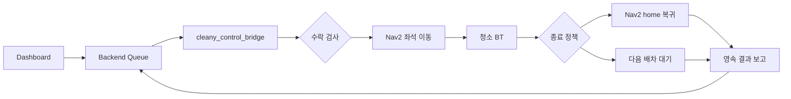

# cleany_mission_manager

SCRUM-420의 단일 로봇 Mission Runtime입니다. 상위 FSM이 수락·이동·작업·복귀·보고를
소유하고, `py_trees` Behavior Tree가 책상 작업의 반복과 완료 확인을 소유합니다.
순수 core는 ROS 및 네트워크를 호출하지 않고 `start/poll/cancel/ready/stopped` port를 사용합니다.

## 현재 실행 범위

`navigation_backend:=nav2`는 Gazebo에서 실제 `NavigateToPose` action을 호출합니다.
Perception과 Planner는 **명시적 Mock**입니다. Executor는 기본 로컬 Mock 또는
`manipulation_backend:=action_mock`에서 팀원의 외부 mock action server를 호출합니다. 두 쓰레기 객체를 처리하고
새 관측에서 완료를 확인하는 흐름이며 실제 카메라·LLM·팔을 호출하지 않습니다.
`navigation_backend:=mock`는 주행도 Mock으로 바꾸는 구조 확인 모드입니다.
실행 출처는 미션 수락 시 저장하고 최종 보고에도 보존합니다.

| 역할 | 구현 |
|---|---|
| 수락 및 상태 전이 | `core/runtime.py`, `runtime_models.py` |
| 청소 BT | `core/cleaning.py` |
| SQLite 중복 실행 방지 및 결과 보존 | `core/journal.py` |
| 비동기 Nav2·TF·odom adapter | `adapters/nav2.py` |
| 단일 물체 조작 계약 및 ROS action adapter | `core/manipulation.py`, `adapters/manipulation.py` |
| 교체 가능한 책상 Mock | `mocks/desk.py` |
| ROS service 및 steady-clock tick | `node.py` |

기존 `core/manager.py`의 동기식 prototype은 호환성을 위해 유지합니다.
신규 ROS 실행 경로는 `MissionRuntime`을 사용합니다.

## 실행 흐름과 소유권



Backend가 Queue와 배차를 소유합니다. Runtime은 별도 Queue를 만들지 않고, IDLE 및
모든 port의 준비·정지 여부, 지원 좌석, 요청 유형을 검사해 하나만 수락합니다.
동일 mission ID·동일 요청은 재실행하지 않습니다. 다른 내용으로 ID를 재사용하면 거절합니다.

FSM은 `IDLE → NAVIGATE_TO_TARGET → WORKING → POST_MISSION → RETURN_HOME/IDLE`이며
중단 시 `CANCELLING`, 치명적 오류 또는 정지 확인 실패 시 `ERROR`로 전이합니다.
외부 phase는 `NAVIGATING`, `WORKING`, `RETURNING`으로 노출합니다.

BT는 `ObserveBefore → [PlanNext → ValidateProposal → ExecuteOne → Reobserve → VerifyCompletion]`
반복입니다. 한 번에 한 객체만 실행하고 이후 반드시 다시 관측합니다. snapshot ID와
object ID, 허용 capability를 검사하며 오래된 제안과 임의 skill은 실행하지 않습니다.
`done` 제안만으로 완료하지 않고 추가 fresh 관측에서 처리 대상이 남았는지 확인합니다.
skip·사람 확인·실패·취소는 보고에 보존하며 무조건 SUCCESS로 바꾸지 않습니다.

## ROS 계약

| 이름 | 타입 | 의미 |
|---|---|---|
| `mission/offer` | `cleany_interfaces/srv/OfferMission` | `clean_desk`, `SEAT`, canonical `seat-*` 요청 |
| `mission/cancel` | `cleany_interfaces/srv/CancelMission` | 비동기 취소 수락; 완료는 결과로 확인 |
| `mission/snapshot` | `cleany_interfaces/srv/GetRuntimeSnapshot` | 현재 상태 및 보존된 최종 보고 JSON |
| `mission/reset_error` | `std_srvs/srv/Trigger` | 정지·팔의 주행 가능 상태·Nav2 준비 확인 후 명시적 오류 해제 |
| `mission/status` | `cleany_interfaces/msg/MissionStatus` | transient-local 상태 및 BT 단계 |
| `mission/result` | `cleany_interfaces/msg/MissionResult` | transient-local 최신 최종 보고 |
| `robot/safety_fault` | `std_msgs/msg/String` | `E_STOP` 또는 `HARDWARE_ERROR` 알림 |
| `robot/safety_released` | `std_msgs/msg/String` | 해당 안전 소유자의 해제 알림 |

안전 알림 producer가 실제 정지를 먼저 수행해야 합니다. 이 Runtime은 물리 e-stop 구현이
아닙니다. 안전 오류는 일치하는 release 알림과 정지 확인 후에도 별도 reset이 필요합니다.
주행 취소는 Nav2 terminal 상태와 fresh odom의 정지를 함께 확인합니다. 취소 ACK만으로
IDLE을 만들지 않으며 확인 시간 초과 시 ERROR를 유지합니다.

SQLite journal은 수락, 실행 출처, Nav2 goal UUID, 최종 결과와 오류 상태를 저장합니다.
재시작 당시 미완료 미션은 `INTERRUPTED`와 사람 확인 필요로 보고하고 자동 재개하지 않습니다.
저장된 정확한 UUID에 대해 orphan goal 취소를 요청하고 정지·준비 상태를 확인합니다.
Backend 연결 단절은 이미 수락한 미션의 실행을 중단하지 않습니다.

## 설정과 실행

[runtime.yaml](config/runtime.yaml)과 [좌석 pose](config/study_cafe_targets.yaml)를 설치합니다.
기본 deadline은 주행·청소 각 180초, 단일 작업 30초, 취소 확인 5초이며 steady clock을
사용합니다. `max_actions=30`, `max_skill_retries=2`로 반복을 제한합니다.
설정은 시작할 때 읽습니다. 변경 후 node를 재시작해야 합니다.

`post_mission:=return_home|wait_for_next`로 미결정 복귀 정책을 선택합니다. 기본은
`return_home`이라는 **실행 옵션**이며 제품 정책 확정을 뜻하지 않습니다. `wait_for_next`는
현재 위치에서 다음 Backend 배차를 기다립니다. 미션 간 연결 이동도 새 배차로 시작합니다.
주행 실패는 전체 미션을 자동 재시도하지 않습니다. 일반 취소의 home 복귀 여부도 같은
정책을 따르며, 안전 오류는 복귀하지 않습니다.

좌석 YAML은 `map_id`, `frame_id`, `home`, `seats`를 명시합니다. 현재 seat-12·13 pose와
home은 study-cafe **시뮬레이션 접근 후보**입니다. 충전 dock·팔 도달 가능성·실환경 좌표는
검증되지 않았고, 실제 Gazebo home 복귀 시험도 실패했습니다.

기존 AMCL/Nav2 실행 옆에서 시작합니다. SLAM은 동시에 시작하지 않습니다.

```bash
make build-mission-runtime
source ros2_ws/install/setup.bash
ros2 launch cleany_mission_manager mission_runtime.launch.py \
  gateway_url:=ws://127.0.0.1:8080/api/robots/cleany-01/gateway/ws \
  post_mission:=wait_for_next
```

Nav2 없이 구조를 확인할 때는 위 명령에 `navigation_backend:=mock`를 추가합니다.
실험별 `journal_path`, `bridge_journal_path`를 사용하되 동일 미션을 복구할 때는 동일 DB를
유지합니다. Gazebo부터 함께 시작하려면 [cleany_bringup](../cleany_bringup/README.md)을 봅니다.

```bash
make test-mission-core
make test-mission-runtime
# 실제 ROS transport와 fake Nav2 server를 사용하는 선택 검사
source ros2_ws/install/setup.bash
ROS_DOMAIN_ID=82 CLEANY_RUN_ROS_TESTS=1 make test-mission-core
```

ROS transport 검사는 Gazebo·실물 검증과 구분합니다. 시험 결과와 제한은
[SCRUM-420 검증 기록](../../../docs/validation/scrum-420-mission-runtime.md)에 정리합니다.
기획 근거는 KB [Mission Lifecycle](../../../docs/cleany-docs/20_TECHNICAL/09%20-%20Mission%20Lifecycle.md),
[Robot ROS Contract](../../../docs/cleany-docs/20_TECHNICAL/10%20-%20Robot%20ROS%20Contract.md),
[안전](../../../docs/cleany-docs/20_TECHNICAL/08%20-%20Safety%20and%20Risk.md)을 따릅니다.
KB는 이 구현 변경에서 수정하지 않습니다.

## 단일 물체 Manipulation 연결

청소 BT가 관찰과 Planner 제안을 검증한 뒤 물체 하나의 action을 보냅니다.
Executor 내부의 BT/XML이나 접근·집기 단계 순서는 Mission Manager가 소유하지 않습니다.
원격 `feat/manipulation-action-server`의 `46efa012cddb4ef0ff3f4dadb785550591bb6073`에서
아래 세 interface만 동일하게 가져왔으며 서버 코드와 나머지 브랜치는 병합하지 않았습니다.

| 상대 이름 기본값 | 타입 | 의미 |
|---|---|---|
| `mock/manipulation/execute_skill` | `ExecuteManipulationSkill` | 승인한 snapshot의 numeric object를 지정한 destination으로 이동 |
| `mock/manipulation/get_execution` | `GetManipulationExecution` | 동일 execution ID의 영속 결과 확인 |

요청은 `mission_id`, `task_id`, `execution_id`, `skill_name=collect_trash`, `snapshot_id`,
`uint32 object_id`, `destination_id`입니다. 표시용 object ID와 wire ID를 분리하고,
`SceneObject.wire_object_id`를 Planner 제안과 대조합니다. `trash-1`을 숫자로 추정하지 않습니다.
목적지는 `RuntimePolicy.manipulation_destinations`의 allowlist로 검사합니다.
행동마다 새로운 execution UUID를 발급하고 전체 요청을 SQLite에 저장한 **뒤** 전송합니다.
이 UUID를 ROS goal UUID에도 사용하므로 지연 수락·재시작 취소는 정확한 goal만 대상으로 합니다.

ROS action의 SUCCEEDED만으로 청소 성공을 판단하지 않습니다. 팀원 서버는 BLOCKED도
ROS SUCCEEDED로 반환합니다. payload의 SUCCESS와 일치하는 execution ID, mock 출처,
`LEFT_GRIPPER`, `CONFIRMED`, placement 검증 완료, 팔 복귀 및 정지 확인을 함께 검사합니다.
결과 전체와 task/execution/destination ID를 `report_json.actions`와 SQLite에 보존합니다.
`CANCELED` payload는 Runtime의 `CANCELLED`로 변환합니다.

정지와 주행 가능 여부를 분리합니다. 정지 확인이 있어도 물체가 HELD/UNKNOWN이거나
팔이 복귀하지 않았거나 사람 확인이 필요하면 home과 다음 미션 이동을 차단합니다.
취소 결과는 CANCELLED로 보존하면서 FSM은 ERROR와 사람 확인 필요 상태를 유지합니다.
이 상태에서는 `reset_error`도 주행 가능 조건을 우회하지 못합니다.
현재 서버에 수동 팔 복구·해제 계약은 없으므로 Runtime이 임의로 복구 동작을 실행하지 않습니다.

전송·결과가 불확실하면 같은 execution ID로 조회하며 새 ID로 자동 재전송하지 않습니다.
현재 peer service는 저장 오류와 기록 없음 모두 `found=false`로 반환할 수 있으므로
이 응답은 미실행·정지 증거가 아닙니다. 진행 중·INTERRUPTED·불일치 결과도 gate를 해제하지 않습니다.
재시작 후에는 저장한 UUID 취소와 조회만 수행하고 미션은 자동 재개하지 않습니다.
이 진단 상태는 journal의 `manipulation_boundary` metadata에도 보존합니다.

### 팀원 mock server와 함께 실행

팀원 브랜치의 서버 패키지를 별도 checkout/overlay에서 빌드해 사용합니다.
이 브랜치의 기존 Skill Executor 패키지에는 해당 서버가 없습니다.
양쪽에서 동일한 `cleany_interfaces`를 빌드·source해야 합니다.
공유 mock 입력은 [server fixture](config/manipulation_server_fixture.yaml),
Runtime 설정은 [runtime_manipulation_mock.yaml](config/runtime_manipulation_mock.yaml)입니다.
실제 카메라 대신 순서가 정해진 네 snapshot을 사용하고, 서버의 성공 결과에 따라
mock 책상 목록에서 해당 물체를 제거합니다. 설정한 snapshot이 소진되면 실패합니다.

```bash
# 팀원의 server overlay를 source한 terminal
ros2 run cleany_skill_executor manipulation_server --ros-args -r __ns:=/mock \
  -p database_path:=/tmp/cleany-manipulation-server.db \
  -p mock_config:=$PWD/ros2_ws/src/cleany_mission_manager/config/manipulation_server_fixture.yaml

# 이 브랜치 Runtime overlay를 source한 별도 terminal
ros2 run cleany_mission_manager mission_runtime --ros-args \
  --params-file ros2_ws/src/cleany_mission_manager/config/runtime_manipulation_mock.yaml \
  -p targets_file:=$PWD/ros2_ws/src/cleany_mission_manager/config/study_cafe_targets.yaml \
  -p journal_path:=/tmp/cleany-manipulation-missions.db
```

`action_mock`만 지원하며 실제 팔 backend를 활성화하지 않습니다.
새 mock DB에서 최초 팔이 안전하다는 가정은 `manipulation_initial_mock_safe=true`로
명시합니다. 기본값은 false이고, 저장된 진행/위험 상태를 이 설정으로 덮어쓰지 않습니다.
조작 실행 기록이 있는 DB에서는 로컬 `mock` backend로 전환해 주행 gate를 우회할 수 없도록 시작을 거부합니다.
실물 연결에는 최신 팔 상태를 제공하는 별도 readiness/복구 계약이 필요합니다.
fixture timeout은 작업 120초, 취소 15초로, 서버의 최대 10초 atomic stage와 정지 확인
시간을 포함합니다. 기본 로컬 mock의 30초/5초 설정과 구분합니다.

```bash
# 팀원 mock overlay + Runtime overlay를 source한 뒤, 격리된 DDS domain에서
ROS_DOMAIN_ID=185 CLEANY_RUN_ROS_TESTS=1 CLEANY_RUN_MANIPULATION_TESTS=1 make test-mission-core
```

이 검사는 mock 조작과 ROS 통신의 증거이며 Gazebo 재검증이나 실제 팔 청소 증거가 아닙니다.

### 개발용 FSM/BT 관측

`mission/debug_snapshot`을 최대 2 Hz로, `mission/runtime_events`를 FSM tick 뒤에 발행한다.
짧게 SUCCESS가 된 뒤 같은 tick 안에서 INVALID로 초기화되는 BT 노드도 `bt_tick`
이벤트로 남긴다. core는 I/O 없이 최대 2,048개 이벤트만 보존한다. debug 발행 실패가
기존 status/result 발행을 막지 않도록 ROS shell에서 분리한다.

`cleany_dev_monitor`는 이 정보와 ROS graph/TF/토픽을 읽어 개발 화면을 제공한다.
자세한 실행과 관측 의미는 [개발 관제보드 README](../cleany_dev_monitor/README.md)를 본다.
`safe_to_drive`는 기존 executor의 판단을 보여주며 관제보드가 새로 안전 판단을 하지 않는다.
