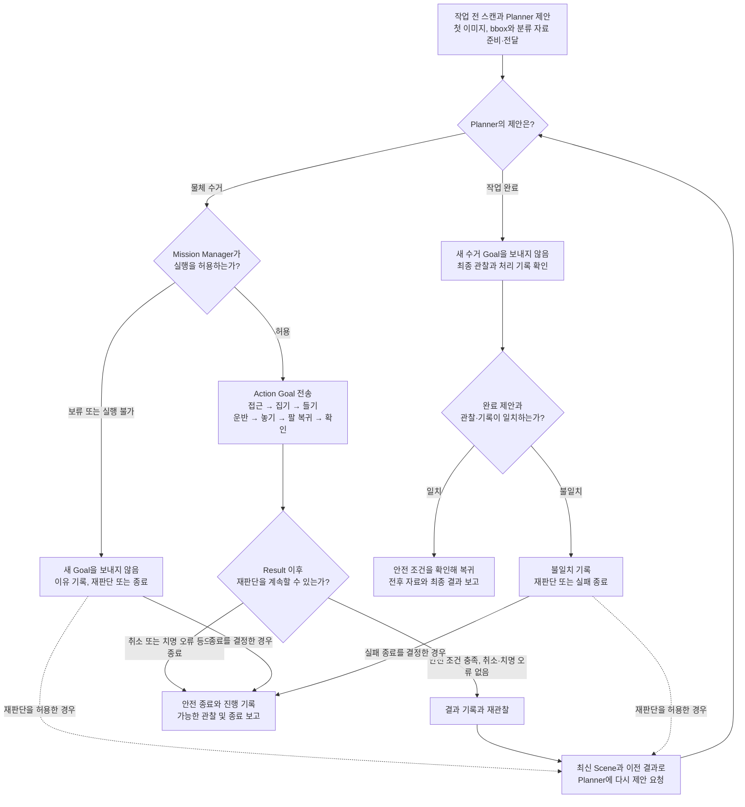

# 01. 매니퓰레이션 Action 설계 안내

> **모의 1차 구현과 후속 설계, 2026-09-30.** GitHub KB `main`의 `4b6816e`를 기준으로 재작성했다.
> 기존 Mission Manager의 행동 승인과 재관찰 책임을 유지한다.
> Action, Python 모의 서버와 SQLite 기록 조회를 구현했다. 실행은 [사용법](manipulation_mock_usage.md)를 따른다.

## 1. 먼저 이해할 한 문장

**Mission Manager가 행동 하나를 승인하고, Manipulation Action 서버가 그 행동의
팔과 그리퍼 동작을 수행한 뒤 결과를 돌려준다.**

예를 들어 `collect_trash(물체 3번)`을 한 번 요청하면 서버가 접근, 집기, 들기,
수거함으로 운반, 그리퍼를 열어 놓기, 팔 복귀와 놓은 결과 확인을 처리한다.
이 세부 동작마다 Mission Manager를 다시 호출하지 않는다.
다음 물체는 결과 재관찰 후 Planner가 제안하고 Mission Manager가 승인한다.

| 질문 | 답 |
|---|---|
| 여러 물체도 처리하는가? | 행동 하나 실행, 재관찰과 다음 제안을 반복해 여러 물체를 처리한다. |
| Goal 하나가 책상 전체를 정리하는가? | 이번 명세의 Goal은 승인된 high-level 행동 하나다. |
| 인식만 별도로 사용할 수 있는가? | Perception의 `InspectScene`은 독립 Action으로 계속 사용할 수 있다. |
| 모든 팔 동작을 Mission Manager가 지시하는가? | 접근, 들기, 운반 등의 동작은 Skill Executor 내부에서 처리한다. |
| 서버 개발에 Mission Manager 완성이 필요한가? | 같은 검증 조건을 갖춘 테스트 클라이언트와 mock port로 개발할 수 있다. |

## 2. 기준으로 읽은 KB

| 문서 | 적용하는 내용 |
|---|---|
| [Mission Lifecycle](../../../../docs/cleany-docs/20_TECHNICAL/09%20-%20Mission%20Lifecycle.md) | 행동 하나 승인, 성공과 실패 및 차단 후 재관찰 |
| [Task Planning and Robot Capabilities](../../../../docs/cleany-docs/20_TECHNICAL/03%20-%20Task%20Planning%20and%20Robot%20Capabilities.md) | Planner 제안, Mission Manager 검증, Capability 물리 실행 |
| [ROS 2 Software Architecture](../../../../docs/cleany-docs/20_TECHNICAL/11%20-%20ROS%202%20Software%20Architecture.md) | Manipulation에 Action 사용, 정확한 schema는 구현 문서에서 관리 |
| [Target Scenario](../../../../docs/cleany-docs/10_PLANNING/02%20-%20Target%20Scenario.md) | 여러 물체, 작업 전후 관찰, 복귀와 Dashboard 결과 |
| [Success Criteria](../../../../docs/cleany-docs/10_PLANNING/05%20-%20Success%20Criteria.md) | Rule-based 통합 검증과 VLA 실행을 포함한 목표 MVP의 통과 조건 |
| [Robot Operations and Mission Dispatch](../../../../docs/cleany-docs/20_TECHNICAL/02%20-%20Robot%20Operations%20and%20Mission%20Dispatch.md) | 재시작 시 자동 재개 금지, 외부에 중단과 사람 확인 필요 보고 |
| [책임 경계 결정](../../../../docs/cleany-docs/30_DECISIONS/Technical/260806%20-%20Task%20Planning과%20Robot%20Capability%20경계.md) | Mission Manager의 allowlist와 기본 인자 검증, 하위 물리 제약 검증 |

`CLEAN_TABLE` 상태와 책상 전체 `ExecuteTableManipulation` 제안은 과거 비교 자료다.
그 제안의 미션 상태 변경과 결과 필드를 이 명세의 전제로 사용하지 않는다.

## 3. 누가 무엇을 하는가

| 담당 | 역할 | 예시 |
|---|---|---|
| Mission Manager | 행동 승인, 실행 요청, 결과 기록과 재관찰, 전체 미션 보고 | 이 단계에서 수거를 허용할지 검사 |
| Planner | 최신 장면과 이전 결과로 다음 행동 또는 완료 제안 | 물체 3번을 먼저 수거하자 |
| Perception | 물체, 이미지 영역과 3D 정보 제공 | 물체 3번의 bbox와 위치 |
| Manipulation Action 서버 | 행동 하나의 실행 순서, Feedback와 Result 관리 | 접근부터 놓은 결과 확인까지 |
| Motion 또는 VLA backend | 동작 생성, 물리 제약 검사, 실행과 정지 | MoveIt, controller와 실험 후 선택할 VLA adapter |
| 관측 전달 기능 | 같은 장면의 원본 이미지와 정보를 묶어 전달 | overlay를 위한 자료 |
| Backend와 Dashboard | 관측 저장, overlay와 최종 결과 표시 | 전후 사진과 미처리 대상 |

Perception 모델과 Planner adapter, Skill 내부 VLA와 MoveIt 조합은 KB의 실험 후보다.
현재 시뮬레이션 구현이 제품의 최종 모델이나 분실물 처리 정책을 결정하지 않는다.

### Action 서버 구현과 목표 MVP의 관계

| 단계 | 확인할 내용 |
|---|---|
| Rule-based 통합 검증 | 규칙 기반 Planner와 실행 계층을 연결해 Goal, 물리 실행 결과, 재관찰과 보고를 검증 |
| 목표 MVP | 위 흐름에 AI의 다음 행동 제안과 **VLA 기반 Manipulation Skill의 물리 실행 및 결과 관찰**을 포함 |

Action 서버는 기존 MoveIt 및 controller port나 mock으로 먼저 개발할 수 있다.
이 검증만으로 목표 MVP를 완료했다고 보고하지 않는다. 목표 MVP에는 VLA 기반 실행과
관찰 결과로 다음 행동 또는 완료를 판단하는 검증이 추가로 필요하다.
VLA 모델, adapter와 MoveIt의 조합은 실험 후 선택하며 이 명세에서 확정하지 않는다.
단계별 통과 조건은 [KB Success Criteria](../../../../docs/cleany-docs/10_PLANNING/05%20-%20Success%20Criteria.md)를 따른다.

### ROS 서버를 세부 동작마다 만드는가

제안하는 Manipulation Action endpoint는 하나다. 접근, 집기, 들기와 운반은 내부 함수
또는 BT node로 연결한다. 기존 Perception의 `InspectScene`, 파지 선택의
`SelectReachableGrasp`는 별도 Action이고, `PlanGrasp`와 `VerifyPlacement`는 기존 Service다.
Service는 잡을 자세나 확인 결과를 요청하는 호출이며 Mission Manager의 새 상태가 아니다.
Task Planner의 다음 행동 제안과 `PlanGrasp`의 grasp 계산도 서로 다른 책임이다.

## 4. 책상에 도착한 뒤의 전체 흐름

**Action 서버는 켜진 채로 대기한다. 실행할 물체 수거가 승인된 경우에만 새 Goal을 받는다.**

| 상황 | Mission Manager가 하는 일 |
|---|---|
| Planner가 물체 3번 수거를 제안하고 검증을 통과 | 물체 3번의 Action Goal 전송 |
| Planner가 작업 완료를 제안 | 새 수거 Goal 없이 최종 관찰과 기록 확인 |
| 제안이 허용 기능 또는 인자 검증을 통과하지 못함 | Goal 없이 이유 기록. 재판단하거나 차단 결과로 종료 |
| 미션 취소 또는 치명 오류 | 안전 종료 경로로 이동. 새 수거 Goal 전송 금지 |

이 표는 Mission Manager가 Goal을 보내기 전의 판단이다. Goal을 보낸 뒤 서버가
거절하거나 수락 후 `BLOCKED`를 반환하는 경우는 [Action 수락 명세](02_execute_manipulation_skill_action_spec.md)의 별도 처리다.
첫 자료를 어느 전달 단계까지 확인하고 움직일지는 [관측 명세](05_initial_table_observation_spec.md)의 미결정 계약을 따른다.
위 그림의 재판단은 안전 조건과 종료 정책을 확인한 경우에만 수행한다.
치명 오류와 취소는 종료 및 안전 경로로 연결하고 새 Goal을 자동으로 보내지 않는다.
취소 뒤 안전하게 관찰할 수 있어도 다음 행동 실행을 재개하지 않는다.

**빈 장면이나 실행할 제안이 없다는 사실만으로 성공을 결정하지 않는다.**
Planner의 완료 제안, 최종 관찰, 처리 기록과 남은 대상을 함께 확인한다.

## 5. 승인된 행동 하나의 내부 동작

선택 물체의 3D 조회나 집기 전 위치 확인은 행동의 준비 과정에 포함할 수 있다.
서버는 다른 물체를 선택하거나 전체 장면에서 새 high-level 행동을 계획하지 않는다.
집기 전 장면이 달라졌다면 이전 Goal을 차단하고 Mission Manager가 재관찰한다.

## 6. 문서 읽는 순서

| 순서 | 문서 | 확인할 내용 |
|---|---|---|
| 01 | [설계 안내](01_manipulation_action_design.md) | 전체 흐름과 책임 경계, 지금 읽는 문서 |
| 02 | [Action 인터페이스 명세](02_execute_manipulation_skill_action_spec.md) | Goal, Feedback와 Result 필드 및 예시 |
| 03 | [서버 동작 명세](03_manipulation_server_behavior_spec.md) | 실행 단계, 준비 조건, 실패와 취소 |
| 04 | [Mission 결과 매핑](04_mission_result_mapping.md) | Action 결과와 기존 core 결과의 차이 |
| 05 | [관측 데이터 명세](05_initial_table_observation_spec.md) | 첫 이미지, bbox, 분류와 작업 후 관찰 |
| 06 | [BT와 Groot2 설계](06_manipulation_behavior_tree_design.md) | 행동 내부 트리, 포트와 실행기 경계 |

## 7. 현재 구현과 추가 개발

| 항목 | 현재 상태 |
|---|---|
| `InspectScene`, grasp 계획과 선택 | 기존 ROS interface와 구현 있음 |
| 집기, 운반, 놓기와 확인 경로 | 시뮬레이션 coordinator에 있음 |
| 새 Manipulation Action | `.action`, Python 모의 서버·테스트 클라이언트·SQLite 기록·조회·복구 이벤트 구현. Mission Manager adapter는 후속 구현 |
| 행동별 재관찰과 Planner 승인 반복 | 목표 KB 흐름. 현재 Mission Manager core에 추가 통합 필요 |
| 원본 snapshot 조회와 관측 이벤트 | 새 조회 및 전달 계약 구현 필요 |
| MuJoCo BT.CPP 실행기 | [cleany_manipulation_bt](../../cleany_manipulation_bt/README.md)에 구현. 별도의 실행 XML과 실제 인식·MoveIt 경로 사용 |
| Groot2 설계 XML과 모의 모니터 | 정적 미리보기와 이벤트 투영. Groot2Publisher 실시간 연결은 후속 구현 |

모의 서버는 실제 팔 명령을 내리지 않으며 미션 FSM 통합은 후속 단계다. 남은 제품 판단은 각 명세에 표시한다.
