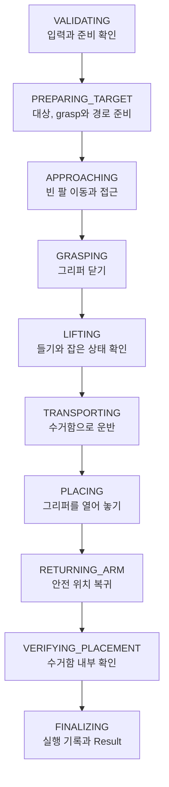

# 03. Manipulation 서버 동작 명세

> **모의 1차 구현과 후속 backend 설계.** 대상은 승인된 `collect_trash` 행동 하나다.
> 서버는 책상 전체의 물체 선택, Planner 호출과 완료 판정을 맡지 않는다.
> Python 모의 서버의 실행·설정·검증은 [사용법](manipulation_mock_usage.md)를 따른다.

## 1. 시작과 종료 경계

| 시작 | 종료 |
|---|---|
| 승인된 Goal과 관찰 참조를 받음 | 행동 Result와 실제 물체 및 팔 상태를 반환 |
| 선택된 물체와 목적지를 물리적으로 검사 | Mission Manager가 기록, 재관찰과 다음 판단 |

새 Goal을 실행하기 전에 이전 실행의 기록과 정지 상태를 확인한다.
같은 서버와 관련 팔 및 그리퍼 자원을 쓰는 Goal은 한 번에 하나만 실행한다.
e-stop과 hardware fault의 실제 정지는 ROS Result와 Planner 응답을 기다리지 않는다.

## 2. 시작 전에 확인할 것

| 확인 | 통과 조건 | 실패 처리 후보 |
|---|---|---|
| 지원 행동 | 승인 경로를 거친 `collect_trash` | 구조상 오류는 Goal 거절 |
| backend | mock, 검증 가능한 simulation 또는 준비된 real adapter | `BLOCKED/BACKEND_NOT_READY` |
| 베이스 상태 | 접근 위치 도착, 베이스 정지와 위치 조건 유효 | `BLOCKED/BACKEND_NOT_READY` |
| 팔과 그리퍼 | 새 feedback으로 상태와 정지를 확인, 이전 held 또는 fault 없음 | 준비 불가 또는 기존 fault는 실행 차단 |
| snapshot | 지정 관찰 존재, 기간과 대상 유효 | `BLOCKED/TARGET_UNAVAILABLE` 또는 `STALE_TARGET` |
| 목적지 | 등록된 수거 목적지, 해당 물체의 크기와 경로 유효 | `BLOCKED/DESTINATION_UNAVAILABLE` |
| 확인 기능 | 놓은 결과를 검증할 port 준비 | `BLOCKED/VERIFICATION_UNAVAILABLE` |
| 실행 기록 | ID와 인자가 충돌하지 않고 시작 기록을 보관 가능 | 움직임 전에 차단 |

베이스 정지 기준, snapshot age와 실물 확인 수단은 아직 정해야 한다.
준비 전 움직임이 없고 초기 feedback이 부족하면 `BLOCKED`로 끝낼 수 있지만
`stop_confirmed=true`라고 주장하지 않는다. 이미 움직인 뒤 정지가 불명확하면 `FATAL`이다.
검증이 준비되지 않은 실물 profile은 사용 가능으로 표시하지 않는다.

## 3. 실행 단계

| 단계 | 수행과 통과 조건 | 남길 기록 |
|---|---|---|
| 입력 검증 | 위 시작 조건 확인 | Goal, profile, 초기 상태 |
| 대상 준비 | 선택 물체 3D 정보, grasp와 경로 유효 | snapshot, 팔, 계획 참조 |
| 접근 | 승인된 경로와 최신 제어 feedback으로 완료 확인 | 시작 명령과 접근 결과 |
| 집기 | 그리퍼 접촉 및 제어 결과 확인 | 물체 상태와 근거 시각 |
| 들기 | 들어 올린 뒤 잡은 상태 유지 확인 | `HELD` 또는 불명확 상태 |
| 운반 | 충돌, workspace와 잡은 상태 감시 | 목적지 접근과 이탈 여부 |
| 놓기 | 목적지 유효성 재확인 후 그리퍼 열기 | 명령 성공과 물체 상태를 구분 |
| 팔 복귀 | 경로 실행 및 안전 위치 확인 | `arm_recovered`, 정지 근거 |
| 놓은 결과 확인 | 놓은 뒤의 검증이 성공 조건 만족 | 확인 상태와 관찰 시각 |
| 종료 | 모든 실제 진행 보존 후 Result 반환 | 마지막 완료 단계, 원인과 정지 상태 |

각 motion node는 명령 전과 근거가 생긴 직후 진행을 기록한다. 마지막 단계에서만
기록하면 집거나 놓은 뒤 실패한 사실을 잃는다. `last_completed_stage`는 성공 근거가
있는 단계만 갱신한다. 그리퍼 명령 완료만으로 물체 수거를 완료 처리하지 않는다.

## 4. InspectScene은 무엇인가

**기존 Perception Action의 이름이다. 선택 물체를 잡기 위해 필요한 정보도 제공한다.**

| 요청 종류 | 기존 입력 | 기존 출력 |
|---|---|---|
| 전체 장면 관찰, phase 1 | 빈 `snapshot_id`, `selected_object_id=0` | 2D 검출 목록과 새 snapshot |
| 선택 대상 준비, phase 2 | 기존 snapshot과 물체 번호 | 해당 대상의 3D, mask 기반 cloud와 주변 cloud |

전체 장면의 최초 관찰과 행동별 재관찰은 Mission Manager가 요청한다.
서버는 phase 2를 대상 준비 port에서 호출하거나 이미 검증된 3D payload를 받을 수 있다.
**phase 2는 새 사진으로 책상 전체를 다시 분류하는 요청이 아니다.** 캐시된 관찰에 대해
선택 물체를 복원한다. 집기 전 실제 위치 확인이 필요하면 선택 대상만 확인하는 port를
사용하고, 대상이 달라졌으면 Goal을 차단한다. 다른 대상 자동 선택은 하지 않는다.

기존 [InspectScene.action](../../cleany_interfaces/action/InspectScene.action) 오류를 다음처럼 연결한다.

| 기존 Perception 오류 | 행동 오류 후보 |
|---|---|
| `ERROR_SNAPSHOT_NOT_FOUND`, `ERROR_INVALID_SELECTION` | `TARGET_UNAVAILABLE` |
| RGB-D, mask, depth, plane, TF 오류 | 대상 준비 불가 또는 `STALE_TARGET`, 원래 코드도 보존 |
| detector API, response, internal 오류 | `TARGET_UNAVAILABLE` 또는 `INTERNAL_ERROR`, 원인 보존 |
| Perception 취소 | 상위 취소이면 `CANCELED`; 예상 밖 하위 취소면 실패 원인으로 기록 |

하위 취소만 받았다고 팔 정지가 확인된 것은 아니다. Action Result가 요구하는 물리
상태와 상위 취소 요청을 확인한다. snapshot 오류 이름은 기존 `ERROR_SNAPSHOT_NOT_FOUND`를 따른다.

## 5. 놓은 결과 확인

기존 [VerifyPlacement.srv](../../cleany_interfaces/srv/VerifyPlacement.srv)는
`success`와 `message`만 반환한다. 상세한 센서 판정 enum은 없다.

| 받은 정보 | 기록 후보 | 행동 결과 |
|---|---|---|
| 놓은 이후의 유효한 확인 `success=true` | `CONFIRMED` | 나머지 성공 조건 충족 시 `SUCCESS` |
| `success=false` | `NOT_CONFIRMED` | `FAILED/PLACEMENT_NOT_CONFIRMED` |
| 호출 timeout 또는 응답 불가 | `UNKNOWN` | `FAILED/VERIFICATION_TIMEOUT` 또는 해당 통신 원인 |
| 시작 시 port 없음 | `NOT_CHECKED` | `BLOCKED/VERIFICATION_UNAVAILABLE`, 집지 않음 |

false를 “수거함 밖에 있는 것을 봤다”로 확대하지 않는다. 현재 srv로는 그런 근거를
보장하지 않는다. action 내부 adapter는 응답 false와 호출 timeout은 구분할 수 있다.
명시적 위치 판정이 필요하면 srv 확장을 별도 검토한다.

정상 순서는 팔 복귀 후 확인이다. 팔 복귀가 실패했어도 backend가 독립적인 최신
검증 근거를 제공하면 그 물리 사실을 실패 Result에 보존할 수 있다. 그 경우에도 행동
상태는 `FAILED`다. 증거를 얻지 못하면 확인 성공을 추정하지 않는다.

현재 GUI 관찰형 simulation은 확인을 끄고 `complete_unverified`를 기록한다.
새 제품 Action 제안은 확인 가능한 실행을 기준으로 한다. 확인 생략 모드를 지원하려면
별도 profile과 보고 계약을 검토하고, `CONFIRMED`를 허위로 반환하지 않는다.

## 6. 실패와 재시도

| 상황 | 제안하는 결과 | 다음 판단 |
|---|---|---|
| 움직임 전 대상 또는 목적지 불가 | `BLOCKED` | Mission Manager가 관찰과 새 제안 검토 |
| 움직임 전 계획을 만들지 못함 | `BLOCKED`, `GRASP_FAILED` 또는 `MOTION_FAILED` | 실패 원인과 대상 근거 전달 |
| 접근, 집기, 운반 또는 팔 복귀 실패 | `FAILED` | 동작 종료, 정지와 물체 상태 확인 |
| 물체 상태 유실 | `FAILED/GRASP_LOST`, `object_state=UNKNOWN` | 자동 놓기 금지, 정지 후 재관찰 |
| 수거함 내부 확인 실패 | `FAILED` | 놓기 진행과 확인 실패를 함께 기록 |
| 실제 e-stop 또는 hardware fault | `FATAL` | 하위 안전 경로, 신규 Goal 차단 |
| 실행 후 정지 확인 불가 | `FATAL/STOP_UNCONFIRMED` | 신규 Goal 차단, 즉시 fault 알림 |

접촉 이후 행동 전체를 내부에서 다시 시작하지 않는다. 준비 단계 조회와 motion 계획은
새 움직임이 없고 입력이 유효할 때만 설정된 횟수 안에서 retry할 수 있다.
그 설정과 실행 후 재시도 budget은 별개다. `max_object_attempts`, `max_scan_cycles` 같은
책상 반복 설정은 이 서버가 소유하지 않는다.
관측에서 대상이 사라진 사실만으로 수거 성공을 만들지 않는다.

## 7. 취소는 어떻게 처리하는가

**취소 요청을 받으면 다음 단계 시작을 막고, 현재 동작을 허용된 checkpoint에서 끝내거나
차단한 뒤 정지와 물체 상태를 확인한다.** 새로운 대상이나 행동을 시작하지 않는다.

| 취소 시점 | 서버 처리 | 종료 때 주의점 |
|---|---|---|
| 대상 준비 중 | 진행 중 조회 취소, 움직임 시작하지 않음 | 초기 정지와 실제 변경 유무 확인 |
| 빈 팔 접근 중 | 해당 controller goal 중단, 정지 확인 | 물체를 건드리지 않았는지 검사 |
| 집기 또는 들기 중 | 사전에 정한 짧은 원자 구간을 종료 또는 차단 | 안정된 잡은 상태와 정지 확인. 무조건 그리퍼 열지 않음 |
| 물체 운반 중 | 경로 중단, 물체를 잡은 채 정지 | `HELD`면 베이스 자동 복귀 금지 |
| 그리퍼를 여는 중 | 현재 transaction을 완료 또는 차단 | 명령 완료와 물체 상태를 구분 |
| 팔 복귀 또는 확인 중 | 새 조작 금지, 현재 동작 종료와 정지 확인 | 이미 놓은 사실과 확인 근거 보존 |

집기, 들기 원자 구간의 범위와 제한 시간은 backend별로 정의해야 한다. 제한 없이
취소를 지연하거나, 취소를 받은 뒤 승인되지 않은 운반과 놓기를 새로 시작하지 않는다.
e-stop과 hardware fault는 이 checkpoint 대기를 우회하는 독립 정지 경로다.

### 정지 확인에 필요한 근거

1. 해당 MoveIt 및 controller goal에 중단을 전달하고 종료 응답을 확인한다.
2. 명령 뒤의 **새 feedback**으로 팔과 그리퍼 속도를 확인한다.
3. 설정한 속도 기준과 유지 시간을 만족해야 정지를 확인한다.
4. 확인 제한 시간 안에 증거를 얻지 못하면 정지 미확인으로 종료하고 실행을 차단한다.

같은 feedback을 여러 번 읽은 것을 연속 새 표본으로 세지 않는다. 제한 시간은
프로세스의 단조 시계, sensor freshness는 해당 stamp 및 clock 계약으로 따로 관리한다.
현재 controller stop 경로와 일부 속도 검사는 존재하지만 이 전체 계약은 추가 구현 대상이다.

## 8. 기록, fault와 profile

| 항목 | 구현 요구 후보 |
|---|---|
| 시작 기록 | 실행 ID, 인자 hash, snapshot과 대상, profile을 움직임 전에 보관 |
| 물리 진행 | 집기, 들기, 그리퍼 열기와 확인 근거를 발생 직후 보관 |
| 종료 | 취소와 예외도 마지막 진행과 원인을 반드시 기록 |
| 재시작 | 활성 기록은 중단, 자동 재개 금지. Mission Manager에 중단과 마지막 진행 전달, 외부에 사람 확인 필요 보고 |
| fault 알림 | 안전 경로와 Mission Manager에 즉시 전달. 정확한 진단 topic 또는 port는 구현 시 선택 |
| fault 해제 | 운영자 권한과 로봇 안전 조건 검사. 물리 e-stop 및 hardware fault를 원격 reset으로 해제하지 않음 |
| mock profile | 순수 core와 동작 port 검증 |
| simulation profile | 독립 확인과 stop 근거를 제공하는 simulation adapter |
| real profile | 실제 feedback, 물리 verifier와 안전 경로가 준비되기 전 비활성 |

이번 모의 구현은 SQLite에 최신 기록과 단계별 이력을 동일 트랜잭션으로 저장한다.
execution_id UNIQUE 제약과 DB별 파일 lock을 사용하며 수락 기록과 단계 시작을
동작 전에 저장한다. 조회 Service와 복구 이벤트는 Action 명세 및 README를 따른다.

### 재시작 시 서버와 Mission Manager가 처리할 일

**재시작은 작업 도중 프로그램이나 장치가 종료된 뒤 다시 켜지는 상황이다.**
새 미션 시작과 구분하여 이전 활성 기록을 먼저 확인한다.

| 담당 | 처리할 일 |
|---|---|
| Action 서버의 복구 처리 | 이전 실행 ID와 미션 ID, 마지막 진행 및 확인 근거를 보존하고 중단 사실 전달 |
| 로봇 상태 및 안전 기능 | 현재 팔, 그리퍼, 들고 있는 물체와 정지 여부 확인. 확인 전 새 물리 실행 차단 |
| Mission Manager | 이전 미션을 자동 재개하지 않고 중단과 사람 확인 필요를 보고 자료에 반영 |
| 외부 상태 adapter | Backend에 중단과 사람 확인 필요 전달. 연결이 없으면 보고를 보관하고 재연결 시 전달 |

기록에 집기 명령이 있다는 것만으로 현재 물체를 들고 있다고 확정하지 않는다.
재시작했다는 이유만으로 정상 취소 또는 안전 정지 완료를 보고하지 않는다.
오류 reset이 허용되어도 이전 미션이 자동 재개되지는 않는다.
중단 보고 및 사람 확인 필요는 [KB 운영 규칙](../../../../docs/cleany-docs/20_TECHNICAL/02%20-%20Robot%20Operations%20and%20Mission%20Dispatch.md)의 요구이며,
조회 Service와 복구 이벤트는 모의 서버에 구현했다. Backend 재전송 저장소와
Mission Manager adapter는 후속 구현 대상이다.

### 설정 목록 후보

| 설정 | 용도 |
|---|---|
| `observation_max_age_sec`, `target_check_timeout_sec` | 관찰 기간과 선택 대상 확인 |
| `preparation_timeout_sec`, `preparation_max_retries` | 움직임 전 준비와 제한된 retry |
| `motion_timeout_sec`, `placement_check_timeout_sec` | motion과 놓은 결과 확인 |
| `stop_timeout_sec`, `stationary_velocity_limit`, `stationary_duration_sec` | 새 feedback 기반 정지 판정 |
| `execution_record_retention_sec` | 중복 방지 기록 보관 |
| backend별 베이스, 팔과 그리퍼 readiness 기준 | 시작 및 복귀 허용 조건 |

실물 backend의 기본값은 미정이다. 모의 단계 0.5초·정지 확인 0.1초,
준비·확인 제한 5초·동작 제한 10초·정지 제한 1초는 package YAML에 둔다.
자동 재시도는 0회이며 실제 로봇의 안전 수치로 사용하지 않는다. 현재
`arm_stationary_velocity_rad_s=0.02`, `arm_stationary_samples=5`는 기존 구현값이다.
sample count와 지속 시간, 표본 freshness를 함께 검증하는 계약으로 재검토해야 한다.

## 9. 기존 코드에서 재사용할 부분

| 코드 | 재사용 가능 부분 | 새 계약과 차이 |
|---|---|---|
| [sorting.py](../cleany_skill_executor/core/sorting.py) | pick, transport, release, retreat와 verify 순서 | 예외 전 진행 기록과 typed Result 추가 필요 |
| [sorting_coordinator.py](../cleany_skill_executor/sorting_coordinator.py) | 준비, grasp, motion과 stop port | simulation 전용 전체 반복. 그대로 새 Action으로 감싸지 않음 |
| [nearest_pregrasp_coordinator.py](../cleany_skill_executor/nearest_pregrasp_coordinator.py) | grasp 선택과 arm 동작 | ROS wrapper와 core port 분리 필요 |
| Mission Manager core | 미션 요청과 기존 결과 envelope | 승인된 high-level 행동, 재관찰과 취소 adapter 필요 |

현재 `sorting_required_categories`는 simulation demo에
남는다. 제품 `collect_trash`에는 분실물과 handoff를 자동 포함하지 않는다.
팔 동작을 재사용할 때 시뮬레이션 좌석 순회와 물체 선택까지 서버로 가져오지 않는다.

관련 문서: [Action 명세](02_execute_manipulation_skill_action_spec.md),
[결과 매핑](04_mission_result_mapping.md), [설계 안내](01_manipulation_action_design.md).

## 10. 모의 서버의 구현 경계

정상 단계는 3절의 순서로 진행한다. core는 비동기 port를 poll하며 ROS timer는
20Hz steady clock을 사용한다. 집기·들기·놓기 취소는 bounded atomic checkpoint,
그 외 단계는 현재 동작 중단 후 정지 확인으로 처리한다. fault는 checkpoint 대기를
우회하고 `FATAL`로 신규 실행을 차단한다. 취소와 Result 확정은 하나의 lock으로 직렬화한다.

재시작 시 활성 기록은 `INTERRUPTED`, 사람 확인 필요로 전환하고 마지막 물리 근거를
보존한다. Action Result를 생성하거나 이전 Goal을 자동 재개하지 않는다.
fault·중단·물체 보유·상태 불명은 신규 Goal을 차단하며 reset은 없다.
저장 실패는 성공으로 보고하지 않고 정지 경로와 `FATAL/INTERNAL_ERROR`로 처리한다.
함께 발생한 hardware fault·e-stop·정지 미확인의 치명 원인은 보존한다.
메모리 진단은 `RECORDING_FAILED`로 명시한다.

Mock adapter는 실제 제어기 feedback, VLA, 실물 verifier 또는 베이스 readiness를
검증하지 않는다. 해당 backend와 권한·복구·원격 전달 계약은 별도로 구현해야 한다.
