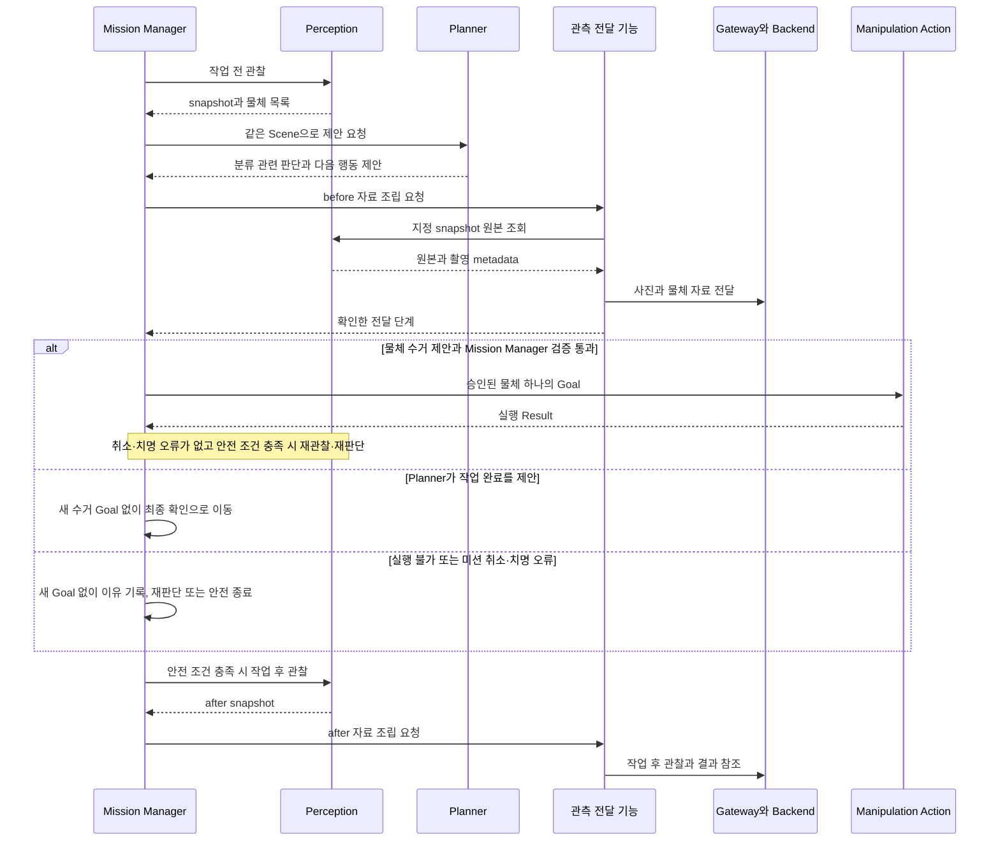

# 05. 작업 전후 이미지, bbox와 분류 전달 명세

> **개발 제안.** 최신 KB의 전후 관찰과 행동 checkpoint를 유지하면서, 상위단이
> overlay를 만들 데이터 묶음을 정리한다. 원본 조회, 이벤트와 Gateway 연결은 추가 구현 대상이다.

## 1. 화면 한 장에 필요한 재료

1280 × 720 사진에서 컵이 `(100, 60, 350, 420)` 영역에 있다면 다음을 함께 전달한다.

| 재료 | 예시 | 상위단 처리 |
|---|---|---|
| 원본 사진 | 같은 snapshot의 RGB | 화면 바탕 |
| 물체 영역과 라벨 | 컵 bbox, `paper_cup` | 상자와 이름 표시 |
| 의미 후보와 신뢰 | `trash`, confidence와 reason | 분류 및 불확실성 표시 |
| Planner 제안 | `collect_trash`, 보류 또는 완료 판단 | 처리 제안 표시 |

**사진의 분류와 실행 허가는 구분한다.** 모델이 `trash`라고 해도 Mission Manager의
승인과 물리 검증을 건너뛰지 않는다. 미분류, review와 분실물 후보도 전체 목록에 남긴다.

## 2. 언제 만들고 누가 요청하는가

호출 주체는 Mission Manager의 관찰 및 보고 흐름이다. `PUBLISH_INITIAL_OBSERVATION`
같은 새 FSM enum을 이 문서에서 추가하지 않는다. Reporter 제공 package와 transport는
구현 선택이며 `cleany_logger` 또는 Gateway adapter를 검토할 수 있다.

**수거할 행동이 없어도 작업 전후 사진과 판단 근거는 남긴다.** Action 서버는
승인된 수거 Goal이 있을 때 실행하며, 완료 제안이나 실행 불가 판단만으로 새 Goal을
받지는 않는다. 완료 제안은 최종 관찰과 처리 기록을 대조한 뒤 판단한다.
각 행동 이후의 반복은 [설계 안내의 전체 흐름](01_manipulation_action_design.md)에 있다.
새 Goal 발행 전 before 자료를 어디까지 전달해야 하는지는 §7의 미결정 계약을 따른다.

| 관찰 종류 | 처리 |
|---|---|
| `before` | 첫 물체를 움직이기 전 자료 생성. Planner 정보가 필요하면 같은 Scene의 제안과 결합 |
| `checkpoint` | 성공, 실패와 차단 후 다음 Planner 판단에 사용. 모든 이미지를 상위단에 보낼지는 미정 |
| `after` | 최종 판단에 사용한 최신 관찰과 처리 기록을 미션 결과에 연결 |

취소 또는 fault로 after 촬영이 불가능하면 관찰이 없다는 이유와 마지막 유효 참조를
기록한다. 오래된 before 사진을 after로 바꾸지 않는다. Planner 호출 실패 시에도 유효한
원본 관찰은 보존하고 proposal 부재를 명시한다.

## 3. 데이터 묶음 후보

### 장면 envelope

| 필드 | 의미 |
|---|---|
| `event_id` | 전송 이벤트 고유 ID. 같은 이벤트 재전송 시 유지 |
| `mission_id` | 연결할 미션 |
| `observation_kind` | `before`, `checkpoint`, `after` |
| `snapshot_id` | 정확한 원본 장면과 검출의 공통 참조 |
| `captured_at`, `camera_frame_id` | 촬영 시점과 카메라 좌표계 |
| `image_width`, `image_height` | bbox가 기준으로 삼는 원본 크기 |
| `image_encoding`, `image_ref` | 원본 표현과 전송 또는 저장 참조 |
| `objects[]` | 관찰에서 얻은 전체 물체 목록 |
| `proposal_ref` | 같은 Scene을 사용한 Planner 제안 참조. 없으면 부재 이유 |

이는 자료 의미의 제안이다. 실제 ROS time 타입, image 또는 compressed image, upload
ref와 저장 API는 transport 선택 뒤 정의한다. 위 필드는 기존 msg가 아니다.

### 물체 항목

| 필드 | 의미와 규칙 |
|---|---|
| `object_id` | 이 snapshot 안의 물체 번호 |
| `label`, `confidence` | 검출 라벨과 신뢰 정보 |
| `x_min`, `y_min`, `x_max`, `y_max` | 원본 픽셀 기준 bbox |
| `model_category`, `model_reason` | 모델 의미 후보. 누락이면 미확정 |
| `planner_judgment`, `planner_reason` | 처리 제안 또는 보류 판단. 모델 분류와 별도 |
| `task_id` | 해당 proposal과 연결할 행동 ID. 없으면 빈 값 |

`planner_judgment`의 허용 값과 정상적인 “제안 없음” 표현은 Planner 계약에서 정한다.
현재 `DetectedObject2D.sorting_category`는 모델 분류이며 최종 실행 승인 필드가 아니다.
after 관찰의 새 object ID를 before ID나 완료 task ID에 번호만으로 연결하지 않는다.
물체 연결 근거와 처리 기록은 미션 결과에서 별도로 보존한다.

## 4. 이미지와 bbox 일치 검사

| 검사 | 통과 조건 |
|---|---|
| snapshot | 원본 조회와 검출의 ID가 동일 |
| 촬영 시점 | 같은 촬영의 stamp, cloud와 검출의 기준 시점을 따로 혼합하지 않음 |
| frame | 같은 RGB 카메라 frame, resize 및 crop 변환이 있으면 명시 |
| 크기 | 원본 크기와 bbox 좌표 기준 동일 |
| 좌표 | 모든 값이 유한, `0 <= x_min < x_max <= width`, y도 동일 |
| Planner | proposal이 같은 Scene을 사용했다는 참조 확인 |
| 원본 | bbox를 그린 debug image를 원본 대신 보내지 않음 |

상위단에서 화면을 축소할 때 x 좌표는 `표시 폭 / 원본 폭`, y는 `표시 높이 / 원본 높이`로
변환한다. letterbox와 crop을 쓰면 offset도 적용한다. 잘못된 좌표를 조용히 잘라서
정상처럼 보내지 않고 변환 정보 또는 검사 실패를 기록한다.

## 5. 빈 장면과 분류 불확실성

- 유효한 빈 관찰은 원본 사진과 `objects=[]`로 표현한다.
- 관찰 실패, 사진 조회 실패와 빈 관찰은 다른 경우다.
- 빈 장면의 최종 성공 또는 `NO_OBJECTS` 정책은 이 transport 명세에서 결정하지 않는다.
- confidence가 낮거나 분류가 없으면 그대로 표시하고 “확실한 쓰레기”로 덮어쓰지 않는다.
- 미처리 대상과 review는 after 장면과 결과에도 남긴다.

빈 장면에는 물리 행동 Goal이 필요 없지만 전후 자료 보존과 완료 판단은 수행할 수 있다.

## 6. snapshot 보존과 조회

현재 [snapshot_cache.py](../../cleany_perception/cleany_perception/snapshot_cache.py)의
기본값은 최대 2개와 TTL 120초다. 독립 Perception 요청이 들어오면 필요한 장면이
조회 전에 밀릴 수 있다. 이것은 새 서버에 충분한 보존 계약이 있다는 뜻이 아니다.

| 필요한 계약 | 이유 |
|---|---|
| 지정 snapshot 원본 조회 port | 현재 Scene 원본 getter ROS interface가 없음 |
| 자료 확보까지 pin 또는 즉시 별도 복사 | 다른 요청자의 scan으로 원본이 밀리지 않도록 |
| 원본과 metadata의 일관된 저장 | 재전송 시 다른 사진을 섞지 않도록 |
| age와 cache TTL 분리 | cache에 남아 있어도 물리 실행에 오래된 장면일 수 있음 |
| 이벤트 보관과 삭제 | media 정책과 완료 여부에 따라 보존 기간 결정 |

## 7. 전달 성공을 어디까지 확인했는가

| 단계 후보 | 확인한 것 |
|---|---|
| `prepared_local` | 원본 및 metadata 검사를 마치고 로컬 보관 |
| `published_local` | publisher 호출을 로컬에서 수행, 호출 오류 없음 |
| `persisted_gateway` | Gateway가 자료를 보관했다는 명시적 확인 |
| `stored_backend` | Backend 저장 확인 응답 |
| `overlay_ready` | 상위단에서 overlay 생성 확인 |

`rclpy.publish()`는 Backend 수신 여부를 반환하지 않는다. 발행 자료 검사가 통과하고
publisher 호출이 예외 없이 끝나도 원격 저장 성공은 아니다. 수신자 수만으로 저장을
확인하지 않는다. 확인 응답이나 조회가 없는 단계는 성공으로 주장하지 않는다.

관측 전달 port는 `delivery_stage`, 로컬 검사 오류와 timeout을 구분해 반환해야 한다.
첫 조작을 로컬 준비, 로컬 발행 또는 원격 저장 중 어디까지 기다릴지는 미정이다.
이 값이 정해지기 전에는 before 자료 발행 실패를 무시하고 집는 정책도, cloud 연결이
항상 필수라는 정책도 하드코딩하지 않는다. KB의 수락 미션 로컬 실행 원칙을 함께 검토한다.

## 8. 전송 중복과 프로세스 재시작

같은 자료 재전송은 `event_id`와 원본을 유지한다. 새로 촬영했다면 새 이벤트다.
미션, 관찰 종류와 snapshot을 연결해 논리 중복을 판별하되 UUID를 매번 재생성하지 않는다.
`sequence`는 전송 envelope가 요구할 때 발급 주체와 범위를 정한다. 현재 계약에 없다고
해 임의 값을 붙여 순서를 보장했다고 주장하지 않는다.

event ID, 자료 참조와 전송 확인을 보관할 저장소 및 outbox는 구현 전 결정 대상이다.
로봇 재시작 후 물리 행동은 자동 재개하지 않는다. 보관된 자료의 재전송과 물리 실행의
재개는 구분해야 한다.

활성 미션 도중 재시작한 경우, Mission Manager의 외부 상태 adapter는 **중단과 사람
확인 필요**도 전달해야 한다. 이 보고에는 마지막 유효 관찰과 실행 기록의 참조를
연결한다. 재시작 후 after를 확보하지 못하면 부재 이유를 남기고, before를 after로
바꾸거나 물리 행동을 다시 실행해 사진을 만들지 않는다.
관측 자료 재전송만으로 중단 보고가 끝났다고 판단하지 않는다.
보고 연결은 [결과 매핑 명세](04_mission_result_mapping.md), 요구의 출처는
[KB 운영 규칙](../../../../docs/cleany-docs/20_TECHNICAL/02%20-%20Robot%20Operations%20and%20Mission%20Dispatch.md)다.

## 9. 구현 및 검증 항목

| 검증 상황 | 기대 결과 |
|---|---|
| 같은 snapshot의 원본과 bbox | overlay에 같은 물체 위치 |
| 이미지와 snapshot 불일치 | 정상 이벤트 발행하지 않음 |
| cache eviction 또는 TTL 만료 | 명시적 조회 실패, 최신 사진 대체 금지 |
| 유효한 빈 장면 | 사진과 빈 목록 보존 |
| Planner의 완료 제안 또는 실행 불가 판단 | 새 수거 Goal 없이 판단 근거와 가능한 전후 관찰 보존 |
| 모델 분류와 Planner 보류 판단이 다름 | 두 판단을 별도 전달 |
| 로컬 publish 완료, Backend 응답 없음 | `stored_backend`로 표시하지 않음 |
| 동일 event 재전송 | 원본과 ID 유지, 중복 저장 방지 계약 확인 |
| after 관찰 실패 | 실패 이유와 마지막 유효 관찰 보존 |
| 활성 미션 도중 재시작 | 물리 행동 자동 재개 없이 중단과 사람 확인 필요 보고, 마지막 자료 참조 보존 |

전송 방식, 최대 크기, 권한, 개인정보, 보관 기간, before 실행 gate와 재스캔 전송 범위는
[Technical Questions](../../../../docs/cleany-docs/20_TECHNICAL/99%20-%20Questions.md)와
[Planning Questions](../../../../docs/cleany-docs/10_PLANNING/99%20-%20Questions.md)의 관련 판단을 따른다.

관련 문서: [설계 안내](01_manipulation_action_design.md), [결과 매핑](04_mission_result_mapping.md).
