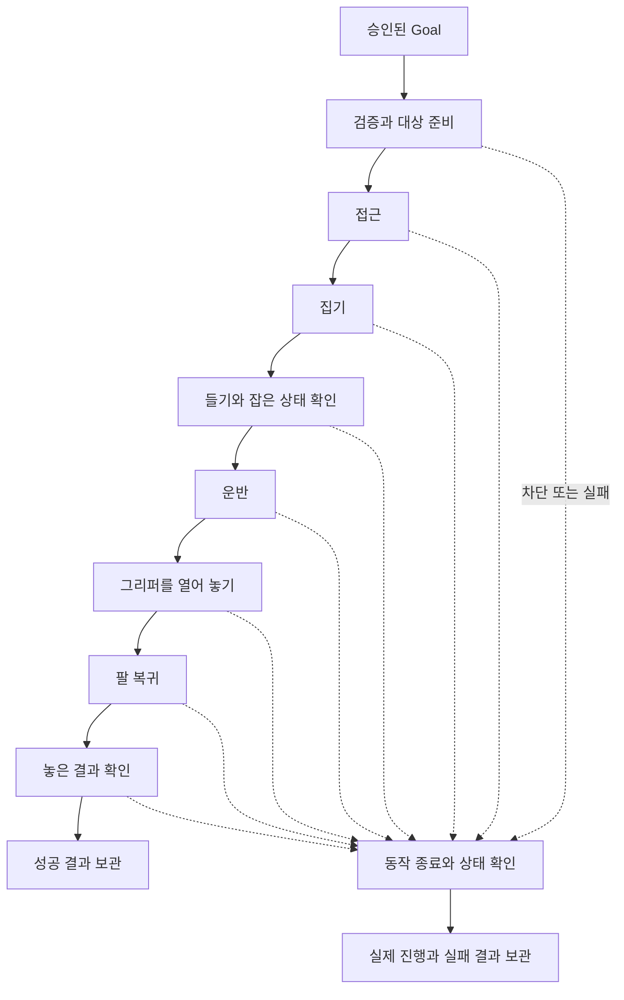

# 06. Manipulation 행동 내부의 Behavior Tree와 Groot2

> **모의 서버용 정적 설계 미리보기.** 이 XML과 포트는 표시·설계 자료다.
> 현재 ROS Action wrapper는 Python 모의 core를 실행하며 이 XML을 실행하지 않는다.
> 실제 MuJoCo BT.CPP 실행기는 [cleany_manipulation_bt](../../cleany_manipulation_bt/README.md)에 별도 구현되어 있다.

로컬 테스트에서는 [VS Code 모니터 브리지](manipulation_mock_usage.md#vs-code에서-로컬-트리-모니터링)로
모의 core의 실행 이벤트를 XML 노드 상태에 투영할 수 있다. 이 표시는 BT.CPP 실행기 채택이나
XML tick 실행을 의미하지 않는다.

## 1. 무엇을 트리로 보여주는가

**이번 트리는 `collect_trash` 행동 하나의 내부 순서를 보여준다.**

| 바깥 흐름 | 트리 내부 |
|---|---|
| Mission Manager와 Planner의 제안, 승인 및 재관찰 | 대상 준비, 접근, 집기, 들기, 운반, 놓기, 팔 복귀와 확인 |
| 다음 물체 선택, 책상 완료와 미션 보고 | 현재 행동의 진행, 실패 처리와 결과 보관 |

여러 물체는 바깥 흐름에서 Goal을 다시 승인해 처리한다. XML 안에 전체 책상
scan 반복이나 Planner 호출을 넣지 않는다.

| 준비 또는 인식 과정 | 실행 위치 |
|---|---|
| Action 서버 시작, 모델 로딩과 워밍업 | 서비스 시작 과정. 수거 Goal마다 다시 실행하지 않음 |
| 책상 전체 최초 관찰, 대상 선택과 승인 | 상위 Mission Manager 및 Perception 흐름 |
| 모델과 실행 backend 준비 여부 확인 | 수거 트리의 `ValidateGoal` |
| 전달받은 관측 확인, 선택 물체 3D 복원과 파지 준비 | 수거 트리의 `PREPARING_TARGET` 세부 단계 |

이 문서의 모의 경로에서 준비 확인과 인식 관련 세부 단계는 모의 결과다.
MuJoCo BT 경로는 실제 모델과 Perception을 사용하며 위 링크의 실행 계약을 따른다.

## 2. 정상 경로와 실패 경로

XML의 정상 경로는 네 개의 Sequence 그룹으로 묶는다. 세부 실행 순서는 유지한다.

| 그룹 | 세부 단계 |
|---|---|
| 준비 | 모델과 실행 준비 확인, 대상 관측 확인, 선택 물체 3D 복원, 파지 후보 생성, 팔과 경로 결정 |
| 물체 잡기 | 잡기 전 위치 이동, 물체 접근, 그리퍼 닫기, 파지 확인, 물체 들어 올리기, 보유 상태 확인 |
| 물체 놓기 | 수거함 이동, 놓을 위치 확인, 그리퍼 열기, 물체 이탈 확인, 팔 복귀 |
| 확인과 종료 | 놓은 결과 확인, 성공 결과 보관 |

VS Code 모니터에서는 그룹도 자식 단계의 진행·완료·실패를 표시한다.
XML을 변경한 뒤에는 브리지를 재시작하고 뷰어의 Monitor를 다시 연결한다.



`Sequence`는 노드를 순서대로 실행한다. 한 노드가 실패하면 뒤의 정상 노드는 실행하지 않는다.
`Fallback`은 정상 Sequence 실패 후 종료 및 결과 보관 경로를 실행한다.
BT의 SUCCESS와 FAILURE는 실행 순서 제어용 값이며 ROS Action의 최종 상태와 별도다.
예를 들어 준비 차단은 BT 정상 경로 실패여도 Result는 `BLOCKED`일 수 있다.

## 3. XML에서 보여주는 노드

| 노드 | 동작 | 대응 Feedback |
|---|---|---|
| `ValidateGoal` | 모델과 실행 준비 확인 | `VALIDATING` |
| `PrepareTarget` | 전달받은 대상 관측 확인 | `PREPARING_TARGET` |
| `ReconstructTarget` | 선택 물체 3D 복원 | `PREPARING_TARGET` |
| `GenerateGrasp` | 파지 후보 생성 | `PREPARING_TARGET` |
| `SelectArmAndPath` | 팔과 경로 결정 | `PREPARING_TARGET` |
| `MoveToPregrasp` | 잡기 전 위치 이동 | `APPROACHING` |
| `ApproachObject` | 물체 접근 | `APPROACHING` |
| `GraspObject` | 그리퍼 닫기 | `GRASPING` |
| `ConfirmGrasp` | 파지 확인 | `GRASPING` |
| `LiftObject` | 물체 들어 올리기 | `LIFTING` |
| `ConfirmHeld` | 보유 상태 확인 | `LIFTING` |
| `CarryObject` | 물체를 든 채 목적지 이동 | `TRANSPORTING` |
| `CheckPlacementTarget` | 놓을 위치 확인 | `PLACING` |
| `OpenGripperAtDestination` | 그리퍼 열기 | `PLACING` |
| `ConfirmRelease` | 물체 이탈 확인 | `PLACING` |
| `ReturnArm` | 지정 안전 위치 복귀 | `RETURNING_ARM` |
| `VerifyPlacedObject` | 놓은 뒤 수거함 내부 확인 | `VERIFYING_PLACEMENT` |
| `FinalizeSuccess` | 성공 조건과 기록 확인, Result 생성 | `FINALIZING` |
| `StopAndAssess` | 하위 goal 종료, 정지와 물체 상태 확인 | `STOPPING` |
| `ReleaseInPlace` | `RETURN_ARM` 취소 중 현재 위치에서 그리퍼 열기 | `RELEASING_IN_PLACE` |
| `ReturnArmAfterCancel` | `RETURN_ARM` 취소 중 팔 복귀 | `RECOVERING_ARM` |
| `FinalizeFailure` | 차단, 실패, 취소 또는 fault Result 보관 | `FINALIZING` |
| `ReleaseInPlace` | 취소 후 잡고 있는 물체를 현재 위치에서 놓기 | `RELEASING_IN_PLACE` |
| `ReturnArmAfterCancel` | 취소 후 현재 상태에서 팔 복귀 | `RECOVERING_ARM` |

동작 노드는 명령 전과 물리 근거를 얻은 직후 진행을 기록한다. 집기와 그리퍼 열기
기록을 트리 끝의 Finalize에만 맡기지 않는다. 물체를 놓은 뒤 검증이 실패해도 놓기
명령과 실제 물체 상태를 보존한다.

모의 서버는 큰 `stage` 안의 현재 `substage`와 `completed_substages`를 기록한다.
브리지는 완료 이벤트가 있는 세부 단계만 초록색으로 표시한다. 그리퍼 닫기 완료는
물체 보유 근거가 아니며, 이탈 근거가 없는 `release_unobserved` 시나리오에서는
`ConfirmRelease`를 완료로 표시하지 않는다. 이후 독립 수거함 확인으로 성공할 수 있다.
세부 단계 추가가 기존 집기, 들기와 놓기의 원자 구간 취소 규칙을 바꾸지는 않는다.

기본 `CHECKPOINT` 외의 취소 방식과 복귀 경로의 제한은
[취소 계약](02_execute_manipulation_skill_action_spec.md#취소-방식과-서비스)을 따른다.
모의 XML의 복귀 노드는 이벤트 표시용이며 수거함 배치 성공을 나타내지 않는다.

`VerifyPlacedObject`는 이번 verified Action에서 생략하지 않는다. 확인 기능이 없으면
시작 검증에서 차단한다. 기존 GUI simulation의 확인 생략 경로는 별도 demo다.

## 4. Blackboard와 포트 후보

| Blackboard key | 내용 |
|---|---|
| `goal` | 승인된 Action Goal |
| `execution` | 물체와 팔 상태, 마지막 완료 단계, 계획과 검증 근거 |
| `error` | 원인과 실패 단계. 시작 시 NONE |
| `result` | 최종 Action Result |

| XML 포트 | 방향 | 연결 |
|---|---|---|
| `goal` | 입력 | `{goal}` |
| `context_in` | 입력 | `{execution}` |
| `context_out` | 출력 | `{execution}` |
| `error` | 오류 출력 또는 종료 노드 입력 | `{error}` |
| `error_in`, `error_out` | 종료 분석의 입력과 출력 | `{error}` |
| `result` | 출력 | `{result}` |

`SkillGoal`, `SkillContext`, `SkillError`와 `SkillResult`는 화면 표시용 타입 이름이다.
현재 C++ 또는 Python class가 있다는 뜻이 아니다. 실제 typed 모델과 변환 규칙은 구현해야 한다.
Groot2에서 포트와 연결 이름을 볼 수 있지만 정적 XML에 센서 값이나 실시간 객체는 없다.

## 5. 실패, 취소와 halt 처리 계약

기본 취소는 `CHECKPOINT`다. 현재 노드를 마치고, 잡기·들기·놓기에서는 원자 구간의
확인까지 완료한다. `IMMEDIATE`는 현재 완료를 기다리지 않고 중단한다. `RETURN_ARM`은
현재 작업 중단과 정지 확인 뒤 물체를 잡고 있으면 그 자리에서 놓고 팔을 복귀한다.
현재 위치 놓기의 별도 안착 검증은 초기 정책에 포함하지 않는다. native MuJoCo 트리는
복귀 뒤 정지를 다시 확인하고 복귀 실패 시 정지 평가로 연결한다.
[native BT 구현](../../cleany_manipulation_bt/README.md)의 실패 경로를 따른다.

| 상황 | 처리 후보 |
|---|---|
| 일반 node FAILURE | Fallback의 StopAndAssess와 FinalizeFailure 실행 |
| 정지 근거 없음 | 종료 분석 context에 `stop_confirmed=false`, FATAL 원인 기록 |
| `halt()` 또는 예외 | 실행 host가 try/finally로 동일한 종료 및 보관 port 실행 |
| 비상 정지 | controller 및 hardware 안전 경로 우선, tree tick을 기다리지 않음 |
| 기록 실패 | 경고 전달, 실제 실행 상태 유지. 저장 실패만으로 동작·신규 Goal을 차단하지 않음 |

`StopAndAssess`의 SUCCESS는 **분석을 마쳤다**는 제어 값이다. 정지가 성공했다는
뜻으로 사용하지 않는다. 정지 미확인도 context와 error에 담아 FinalizeFailure까지
전달한다. 정지 분석 자체가 예외로 끝나면 host의 종료 port가 UNKNOWN 상태를 보관한다.

트리가 halt되면 Fallback까지 tick될 것이 보장되지 않는다. 따라서 XML의 실패 경로만으로
취소 처리를 완성했다고 볼 수 없다. 종료 보관은 `execution_id` 기준 멱등 처리하고,
트리와 host가 모두 호출해도 결과를 중복 작성하거나 물체를 다시 움직이지 않아야 한다.

자동 `RetryUntilSuccessful`, 전체 행동 반복 또는 무조건 성공 decorator는 넣지 않는다.
준비 조회 retry는 서버 설정과 node 계약에서 제한하고, 접촉 이후 새 시도는 Mission
Manager의 재관찰 및 승인을 따른다.

## 6. Groot2에서 열기

[groot2_table_cleanup.xml](groot2_table_cleanup.xml)의 기본 트리는 `CollectTrashSkill`이다.
파일명은 기존 실행 스크립트와 연결을 유지한다. 이름이 table_cleanup이어도 실행 범위는
행동 하나다.

레포 루트의 그래픽 데스크톱 터미널에서 실행한다.

```bash
tools/groot2/open-table-tree.sh
```

스크립트가 표시한 XML 경로를 Groot2의 Load Project or File 메뉴에서 열고
`CollectTrashSkill`을 선택한다. 현재 환경의 설치 버전과 architecture는
[release.sh](../../../../tools/groot2/release.sh)에 있고, 해당 installer는 aarch64용이다.
재설치가 필요하면 그 설정과 일치하는 로컬 AppImage를 전달한다.

```bash
tools/groot2/install-local.sh /path/to/matching-Groot2.AppImage
```

기존 설치 스크립트의 version과 checksum을 이 문서에서 새로 고정하지 않는다.
다른 architecture의 설치는 별도 환경 설정이 필요하다.

## 7. Groot2 실시간 연결의 후속 작업

아래는 이 정적 XML을 Groot2와 실제 실행기로 연결할 때의 작업이다.
현재 MuJoCo 실행기는 별도 XML과 VS Code용 모니터를 사용한다.

1. 사용자 정의 node와 typed port를 실제 BT.CPP factory에 등록한다.
2. Goal마다 context를 생성하고 tick, feedback, cancel과 halt를 연결한다.
3. 실제 factory에서 `writeTreeNodesModelXML`로 모델을 생성한다.
4. `Groot2Publisher`와 사용 중인 Groot2 edition 및 연결 조건을 확인한다.

공식 [Groot2 연동 안내](https://behaviortree.dev/docs/tutorial-basics/tutorial_11_groot2/)는
factory의 node 모델과 publisher 연결을 설명한다. 현재 손으로 쓴 모델은 실행기 구현
전의 설계 자료다. 실시간 지원은 사용 중인 edition 조건도 확인해야 한다.

## 8. 이번 파일 검증과 제한

XML 구문, node 모델, 포트 이름과 Blackboard 연결을 정적으로 검사한다.
Groot2 GUI import와 실제 BT.CPP 동작, 취소 및 물리 정지 검증은 별도다.
XML을 여는 것만으로 Action 서버가 생기거나 로봇이 움직이지 않는다.

관련 문서: [서버 명세](03_manipulation_server_behavior_spec.md),
[Action 명세](02_execute_manipulation_skill_action_spec.md), [설계 안내](01_manipulation_action_design.md).
